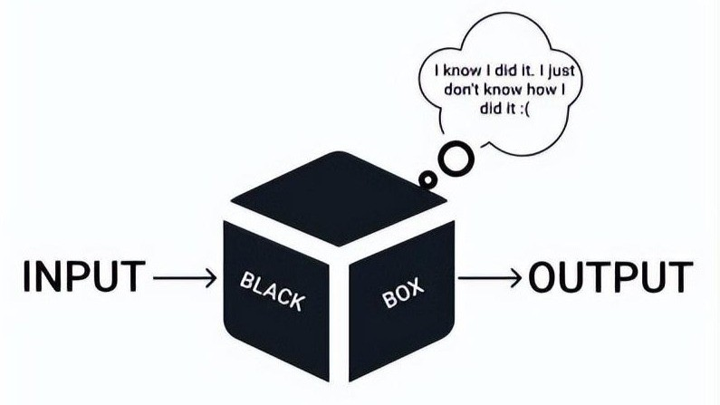
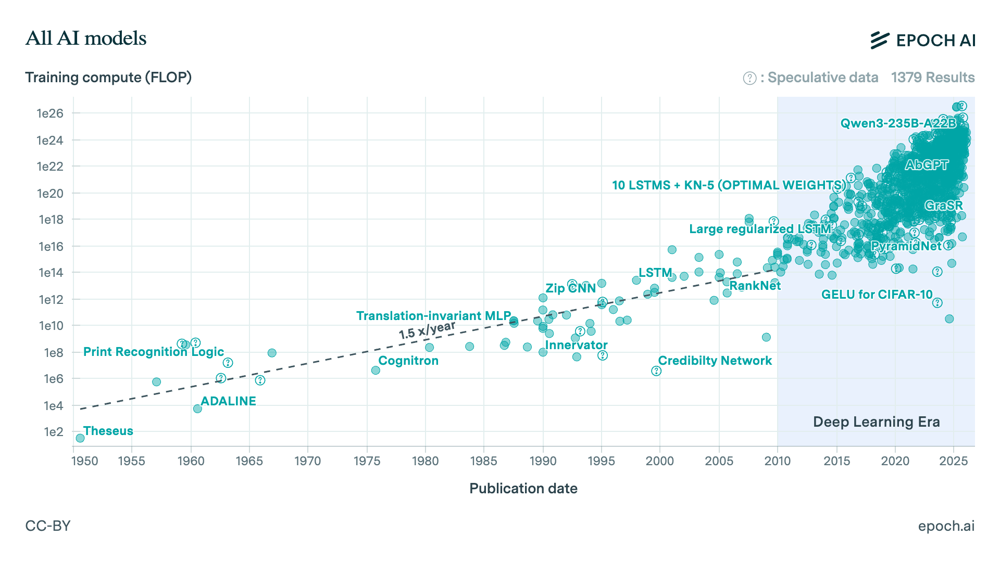

  <a href="../index.qmd" style="font-weight: bold;">← Beranda</a>
  &nbsp;&nbsp;|&nbsp;&nbsp;
  <a href="../materi.qmd" style="font-weight: bold;">Pilih materi →</a>

<h1 style="text-align: center; font-size: 2.5rem; font-weight: bold; margin-bottom: 0.5rem;">
  <a href="basic-konsep-dasar-ml.qmd" style="text-decoration: none; color: inherit;">
    Konsep dasar pembelajaran mesin (<em>machine learning</em>)
  </a>
</h1>

  Oleh <a href="bio.qmd" target="_blank">Agus Wibowo</a>

  

 

# Daftar isi

-   [Pendahuluan](#pendahuluan)
-   [Hanya ada dua masalah](#hanya-ada-dua-masalah)
-   [Data preprocessing](#data-preprocessing)
-   [Resampling: Bagaimana kita tahu model benar-benar bekerja?](#resampling-)

# Pendahuluan

Bagaimana kita mengetahui bahwa kualitas air dapat memengaruhi pertumbuhan udang? atau jika kita punya semua data laboratorium dan performa udang, bagaimana kita bisa mengestimasi tonase panen di siklus depan atau mengestimasi jumlah pakan yang kita butuhkan untuk satu siklus?

Untuk menjawab pertanyaan-pertanyaan tadi, pada dasarnya kita hanya akan memanfaatkan 2 hal: data dan polanya. Dalam data yang ada, kita hanya perlu mencari bagaimana pola umum yang terbentuk dari data-data tersebut. Misalnya, pada kondisi ideal dalam 3 siklus terakhir, kita butuh 60 ton pakan untuk menghasilkan 40 ton udang, dan di sisi lain kita juga telah merekam data kualitas air, kepadatan plankton, dan bakteri di setiap siklus. Sehingga, jika kita bisa "membaca" bagaimana pola umum dari kumpulan-kumpulan data tersebut (jumlah pakan, tonase panen, kualitas air, kepadatan plankton, dan bakteri), maka kita akan bisa memprediksi berapa ton udang yang akan kita peroleh di siklus depan. Cabang ilmu statistik yang berusaha mencari pola dalam data untuk menghasilkan prediksi di masa depan adalah ***statistical learning***.

Dalam *statistical learning*, jumlah pakan, kualitas air, kepadatan plankton dan bakteri disebut juga sebagai **variabel *predictors*** atau secara matematis disimbolkan sebagai $x_i$, sementara tonase panen adalah **varibel *response*** atau secara matematis disimbolkan sebagai $y$, dan jika kita ingin memprediksi nilai selanjutnya dari $y$ setelah kita mengetahui pola umum dalam data, maka disimbolkan sebagai $\hat{y}$ (dibaca y hat). 

*Statistical learning* berangkat dari asumsi bahwa terdapat hubungan sistematis antara variabel-variabel *predictors* dalam data, dan hubungan tersebut dapat dipelajari atau diestimasi, sehingga dapat diringkas dalam bentuk persamaan:

$$
Y = f(X) + \epsilon
$$

Di sini, $Y$ merepresentasikan variabel respons yang ingin kita jelaskan atau prediksi, $X$ adalah kumpulan variabel penjelas, fungsi $f$ adalah hubungan antar *predictors* dan *response*, dan $\epsilon$ menyatakan komponen galat atau noise yang tidak dapat dijelaskan oleh model.

Masalahnya, bentuk $f$ yang sesungguhnya hampir tidak pernah kita ketahui. Yang dapat kita lakukan hanyalah **mengestimasi** nilai-nilai dalam fungsi $f$ menggunakan data yang tersedia, lalu memanfaatkan hasil estimasi tersebut untuk baik untuk inferensi maupun prediksi.

Pada **inferensi**, fokus kita adalah memahami **hubungan** antar variabel.
> *Apakah suhu air berpengaruh signifikan terhadap berat udang? Seberapa besar pengaruhnya?*

Dalam konteks ini, kita membutuhkan model yang dapat menjelaskan bagaimana peranan setiap koefisien dalam model dan keterkaitannya dengan data yang ada, serta signifikansinya dapat diuji secara statistik.

Sebaliknya, pada **prediksi**, tujuan utamanya adalah menghasilkan **perkiraan** nilai $\hat{Y}$ untuk observasi baru.
> *Jika suhu air 28°C dan salinitas 15 ppt, berapa kira-kira berat udang yang dapat diprediksi?*

Di sini, akurasi menjadi prioritas utama. Kita tidak selalu peduli *mengapa* model bekerja, selama prediksi yang dihasilkan cukup tepat.

*Statistical learning* bekerja dengan sangat baik ketika hubungan antar variabel relatif sederhana dan ukuran data masih terbilang kecil. Namun, dalam banyak kasus nyata, hubungan antar variabel menjadi sangat kompleks, tidak linear, dan melibatkan banyak faktor dengan ukuran data yang sangat besar. Sebagai contoh, salah satu aspek yang mendukung imunitas udang adalah eksistensi bakteri baik (eg. *Bacillus* sp) dalam sistem pencernaan, sementara keseimbangan antara bakteri baik dan oportunis (eg. *Vibrio* sp) pada lingkungan (air budidaya) merupakan kunci supaya penyakit seperti *Acute Hepatopancreatic Necrosis Disease* (AHPND) tidak muncul. 

Namun kenyataannya, komposisi bakteri pada air dan pada usus udang sering kali sangat berbeda. Meskipun komposisi bakteri dalam usus sudah relatif seimbang, dominasi *Vibrio parahaemolyticus* di lingkungan dapat meningkatkan risiko diproduksinya toksin PirA/B, sehingga AHPND tetap berpotensi terjadi. Di sisi lain, petambak ingin mengetahui faktor-faktor spesifik apa saja yang memengaruhi dinamika komposisi bakteri ini, baik di pencernaan maupun di lingkungan, serta bagaimana rasio antar bakteri tersebut kemungkinan berubah dalam beberapa hari ke depan, supaya ia dapat menentukan jenis *treatment* yang paling tepat. 

Pada kasus ini, variabel-variabel $x$ akan sangat banyak, mulai dari jenis *treatment* (misal ada 5 treatment berbeda), kualitas air (pH, salinitas, suhu, NH3), komposisi bakteri, hingga faktor lain seperti sumber benur dan jumlah pakan. Selain itu, banyak variabel tersebut saling bergantung satu sama lain (***multicollinearity***), sehingga hubungan antara variabel $x$ dan respons $y$ sulit dirumuskan dalam bentuk fungsi sederhana. 

Di sinilah *machine learning* menawarkan keunggulan lebih. Alih-alih mengasumsikan bentuk fungsi $f$ sejak awal, model ini membiarkan data itu sendiri yang membentuk fungsi $f$, sekompleks apa pun hubungannya. Model-model *machine learning* dirancang untuk menangani data berukuran besar dan berdimensi tinggi, ketika metode statistik klasik mulai kewalahan. Selain itu, model-model *machine learning* tidak bergantung pada asumsi linearitas atau distribusi tertentu, sehingga pola yang rumit dan tidak linear pun dapat dipelajari tanpa perlu diprogram secara eksplisit.

Namun, ketika kita beralih dari pendekatan *statistical learning* ke *machine learning*, fokus utamanya bukan lagi berusaha memahami mekanisme biologis secara kausal, melainkan memprediksi dinamika komposisi bakteri dan menentukan tindakan praktis yang optimal. Kita tidak lagi peduli bagaimana secara biologis treatment A memengaruhi komposisi bakteri melalui mekanisme tertentu, melainkan apakah dengan menerapkan treatment A pada kondisi lingkungan tertentu, model mampu memprediksi bahwa rasio bakteri akan bergerak ke arah yang kita inginkan dan risiko penyakit dapat ditekan. Nah, fenomena inilah yang disebut sebagai *black box paradox*, di mana kita tahu bahwa model bekerja dengan baik dengan hasil prediksi yang bagus, tetapi kita tidak mampu menjelaskan secara rinci *mengapa* dan *bagaimana* model yang kita gunakan menghasilkan prediksi tertentu. Akurasi nyaris 100% diperoleh, tetapi kita tidak bisa menjelaskan faktor apa yang paling berpengaruh dan bagaimana faktor-faktor yang ada mempengaruhi variabel *response*.

Dikutip dari [Epoch AI](https://epoch.ai/data/ai-models), setidaknya terdapat 3200 model learning yang sudah dikembangkan sejak 1950 hingga saat ini, yang mana terbagi dalam 3 kelas utama: *machine learning* tradisional (*supervised* dan *unsupervised*), *deep learning*, dan *generative* AI seperti Transformer dan BART.

Namun pada pembahasan ini, kita hanya akan belajar tentang *statistical* dan *machine learning*, mengingat kedua kelompok ini merupakan fondasi utama dari pengembangan model-model lanjutan, sehingga pemahaman mendasar terlebih dahulu tentang konsep linearitas dan non-linearitas menjadi sangat penting.

# Hanya ada dua masalah

Sebelum memilih model apa pun, pertanyaan paling mendasar yang harus dijawab adalah: **seperti apa variabel *response* $Y$ yang ingin kita prediksi?**

Jawaban atas pertanyaan ini akan menentukan banyak hal, mulai dari jenis model yang digunakan hingga cara kita mengevaluasi performa model.

Jika target yang ingin diprediksi berupa **nilai numerik yang kontinu**, maka permasalahannya disebut **regresi**. Artinya, model diminta untuk menghasilkan sebuah angka.

> *Berapa berat panen udang minggu depan?*  
> *Berapa harga jual ikan berdasarkan ukuran dan jenisnya?*  
> *Berapa kadar oksigen terlarut yang dibutuhkan tambak ini?*

Dalam kasus ini, $Y$ dapat bernilai hampir apa saja, misalnya 1.2 kg, 3.7 kg, atau 10.4 kg. Tugas model adalah menghasilkan nilai numerik, lalu kita menilai performanya dengan melihat seberapa dekat prediksi tersebut terhadap nilai sebenarnya.

Sebaliknya, jika target yang ingin diprediksi adalah **keanggotaan dalam suatu kelompok**, maka permasalahannya disebut **klasifikasi**.

> *Apakah udang ini sehat atau sakit?*  
> *Spesies ikan apa ini? bandeng, nila, atau lele?*  
> *Apakah tambak ini berisiko tinggi, sedang, atau rendah?*

Pada kasus ini, $Y$ bukan berupa angka, melainkan **label kategori**. Model tidak diminta untuk menebak nilai, melainkan memilih satu kelas yang paling sesuai. Kinerja model diukur dari seberapa sering ia memilih kelas yang benar.

Klasifikasi dengan **dua kelas** (misalnya sehat/sakit atau ya/tidak) disebut *binary classification*. Sementara itu, klasifikasi dengan **lebih dari dua kelas** (misalnya bandeng/nila/lele) disebut *multiclass classification*.

Menariknya, hampir semua model yang akan kita pelajari mampu menangani **regresi maupun klasifikasi**, sering kali hanya dengan sedikit penyesuaian pada bagian akhir model. Perbedaannya bukan terletak pada cara model belajar dari data, melainkan pada **bentuk keluaran** yang dihasilkan dan **metrik evaluasi** yang digunakan. Inilah sebabnya mengapa memahami perbedaan antara regresi dan klasifikasi sejak awal sangat penting, karena konsep ini menjadi fondasi bagi seluruh keputusan pemodelan selanjutnya.
