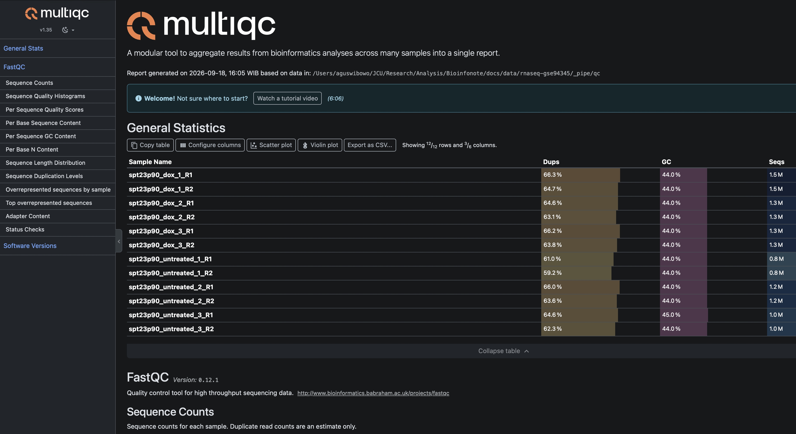
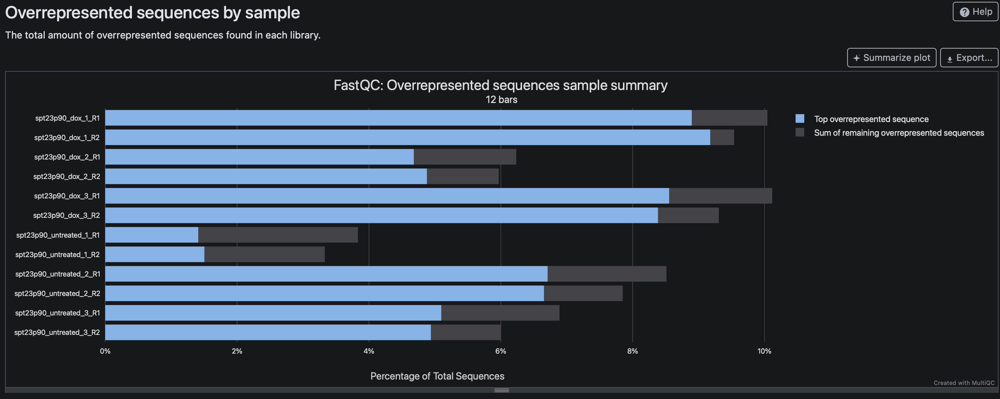
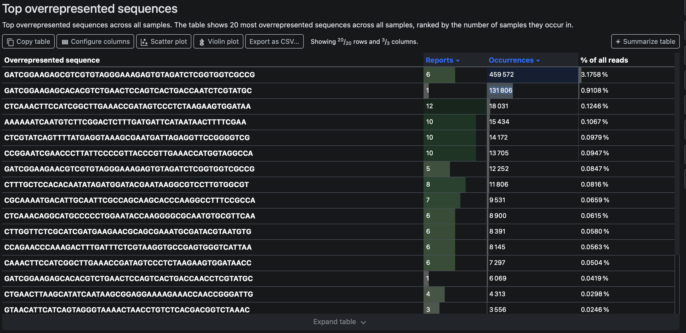
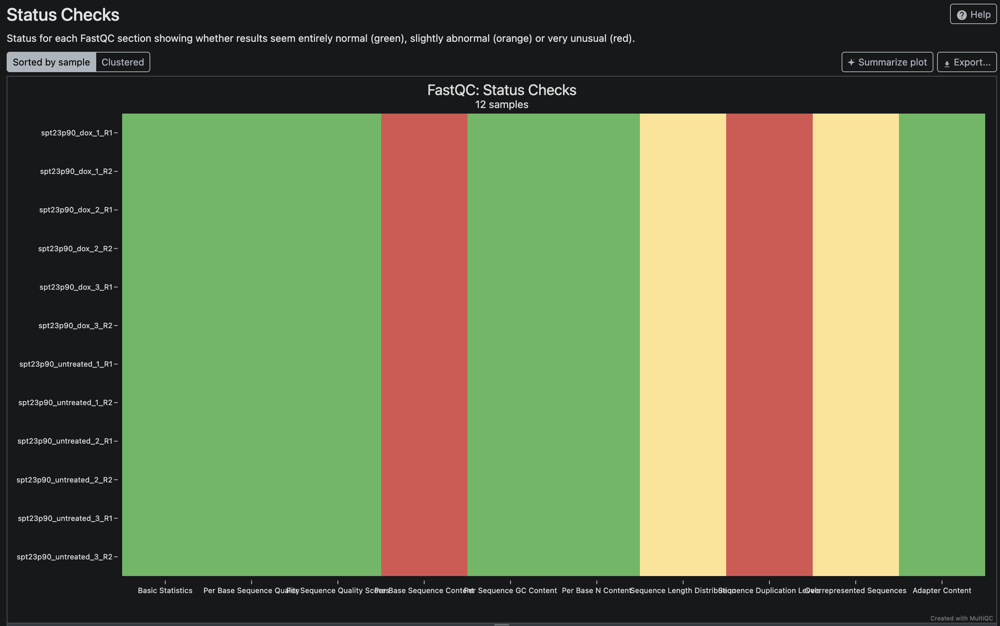

{.content-image .article-hero-image fig-alt="Ilustrasi analisis dan quality control data"}

## Daftar isi

- [Tujuan dan data contoh](#tujuan-dan-data-contoh)
- [Menyiapkan perangkat dan mengunduh FASTQ](#menyiapkan-perangkat-dan-mengunduh-fastq)
- [Memahami FASTQ](#memahami-fastq)
- [Menjalankan FastQC dan MultiQC](#menjalankan-fastqc-dan-multiqc)
- [Membaca hasil dan menentukan tindakan](#membaca-hasil-dan-menentukan-tindakan)
- [Mengapa adapter muncul di read?](#mengapa-adapter-muncul-di-read)
- [Memangkas adapter dengan Cutadapt](#memangkas-adapter-dengan-cutadapt)
- [Menilai hasil pascatrimming](#menilai-hasil-pascatrimming)

> Catatan: tutorial ini memakai Bash dan data publik GSE94345 yang sudah tersedia secara lokal. Jalankan semua perintah dari akar repositori `Bioinfonote`. FASTQ dan hasil analisis disimpan di `docs/data/rnaseq-gse94345/`, yang tidak dilacak oleh Git. Hasil dalam artikel ini diverifikasi dengan FastQC 0.12.1, MultiQC 1.35, dan Cutadapt 5.2.

## Tujuan dan data contoh {#tujuan-dan-data-contoh}

*Quality control* (QC) memeriksa FASTQ sebelum *alignment* atau kuantifikasi. Dari QC, kita ingin menjawab dua pertanyaan: apakah kualitas read cukup baik, dan apakah ada bagian teknis seperti adapter yang perlu dibuang. Keputusan trimming harus mengikuti temuan tersebut. Memangkas read tanpa alasan dapat menghilangkan basa yang masih berguna.

Tutorial ini memakai enam sampel RNA-seq *paired-end* ragi (*Saccharomyces cerevisiae*) dari [GEO GSE94345](https://www.ncbi.nlm.nih.gov/geo/query/acc.cgi?acc=GSE94345). Tiga sampel tidak mendapat doxycycline, sedangkan tiga lainnya mendapat doxycycline. Studi tersebut mengamati perubahan transkripsi setelah induksi domain aktif SPT23p90.

## Menyiapkan perangkat dan mengunduh FASTQ {#menyiapkan-perangkat-dan-mengunduh-fastq}

Pasang SRA Toolkit, FastQC, MultiQC, dan Cutadapt dalam satu lingkungan Conda. Menyatukan semua paket di lingkungan yang sama membuat pipeline lebih mudah dijalankan ulang.

``` bash
# Buat lingkungan Conda dan pasang semua perangkat yang dipakai dalam tutorial.
conda create -n rnaseq -c conda-forge -c bioconda \
  sra-tools fastqc multiqc cutadapt -y
conda activate rnaseq
```

Enam run SRA menghasilkan 12 FASTQ, masing-masing satu R1 dan satu R2. Ukuran seluruh FASTQ terkompresi sekitar 623 MiB. Siapkan ruang kosong 8--10 GiB karena konversi SRA membuat berkas sementara yang jauh lebih besar daripada hasil terkompresi.

Perintah di bawah mengunduh arsip SRA, mengubahnya menjadi FASTQ *paired-end*, mengganti nama berkas agar mudah dibaca, lalu mengompresnya. Jika `prefetch` terputus, jalankan kembali perintah yang sama. SRA Toolkit akan melanjutkan run yang belum lengkap.

``` bash
# Hentikan pipeline saat perintah gagal, variabel kosong, atau pipe bermasalah.
set -euo pipefail

# Siapkan direktori kerja untuk arsip SRA, FASTQ, dan berkas sementara.
DD="$(pwd)/docs/data/rnaseq-gse94345"
mkdir -p "$DD/sra" "$DD/raw_reads" "$DD/_tmp"

# Unduh enam run SRA ke direktori data.
prefetch --progress --output-directory "$DD/sra" \
  SRR5220163 SRR5220164 SRR5220165 SRR5220166 SRR5220167 SRR5220168

# Pasangkan setiap run dengan nama sampel yang lebih mudah dibaca.
runs=(SRR5220163 SRR5220164 SRR5220165 SRR5220166 SRR5220167 SRR5220168)
samples=(spt23p90_untreated_1 spt23p90_untreated_2 spt23p90_untreated_3 \
  spt23p90_dox_1 spt23p90_dox_2 spt23p90_dox_3)

# Ubah tiap arsip menjadi R1 dan R2, lalu kompres seluruh FASTQ.
for i in "${!runs[@]}"; do
  fasterq-dump --split-files --threads 4 --temp "$DD/_tmp" \
    --outdir "$DD/raw_reads" "$DD/sra/${runs[$i]}/${runs[$i]}.sra"
  mv "$DD/raw_reads/${runs[$i]}_1.fastq" "$DD/raw_reads/${samples[$i]}_R1.fastq"
  mv "$DD/raw_reads/${runs[$i]}_2.fastq" "$DD/raw_reads/${samples[$i]}_R2.fastq"
done
gzip "$DD"/raw_reads/*.fastq
```

Setelah konversi selesai, direktori `raw_reads/` berisi enam pasang FASTQ.

``` {.text .terminal-output}
# Struktur minimum setelah konversi dan kompresi selesai.
docs/data/rnaseq-gse94345/
└── raw_reads/                 # 12 FASTQ, terdiri atas enam pasang R1 dan R2
```

Direktori `sra/` dan `_tmp/` hanya diperlukan selama pengunduhan dan konversi. Keduanya dapat dihapus setelah semua FASTQ diperiksa.

## Memahami FASTQ {#memahami-fastq}

Setiap read FASTQ memakai empat baris: header, sekuens basa, tanda `+`, dan karakter kualitas Phred. R1 dan R2 membaca dua ujung fragmen biologis yang sama. Karena itu, keduanya harus tetap berpasangan selama trimming dan analisis berikutnya.

``` bash
# Tampilkan dua read pertama dan hitung jumlah read dari banyaknya baris FASTQ.
DD="$(pwd)/docs/data/rnaseq-gse94345"
gunzip -c "$DD/raw_reads/spt23p90_untreated_1_R1.fastq.gz" | sed -n '1,8p'
gunzip -c "$DD/raw_reads/spt23p90_untreated_1_R1.fastq.gz" | \
  awk 'END {print NR / 4}'
```

Perintah tersebut menghasilkan 798.158 read untuk `spt23p90_untreated_1_R1.fastq.gz`. Jumlah barisnya habis dibagi empat, seperti yang diharapkan untuk FASTQ yang utuh.

Jangan mengubah berkas di `raw_reads/`. Pipeline di bawah menulis semua hasil ke `$DD/_pipe/`, sehingga FASTQ mentah tetap tersedia jika analisis perlu diulang.

## Menjalankan FastQC dan MultiQC {#menjalankan-fastqc-dan-multiqc}

[FastQC](https://www.bioinformatics.babraham.ac.uk/projects/fastqc/) memeriksa satu FASTQ pada satu waktu. [MultiQC](https://multiqc.info/) menggabungkan 12 laporan FastQC agar pola antarsampel mudah dibandingkan.

``` bash
# Tentukan sampel dan siapkan direktori untuk FastQC serta MultiQC.
DD="$(pwd)/docs/data/rnaseq-gse94345"
samples=(spt23p90_untreated_1 spt23p90_untreated_2 spt23p90_untreated_3 \
  spt23p90_dox_1 spt23p90_dox_2 spt23p90_dox_3)
mkdir -p "$DD/_pipe/qc" "$DD/_pipe/multiqc"

# Jalankan FastQC pada R1 dan R2 dari setiap sampel.
for s in "${samples[@]}"; do
  fastqc --threads 4 --outdir "$DD/_pipe/qc" \
    "$DD/raw_reads/${s}_R1.fastq.gz" \
    "$DD/raw_reads/${s}_R2.fastq.gz"
done

# Gabungkan seluruh laporan FastQC menjadi satu laporan MultiQC.
multiqc --force --outdir "$DD/_pipe/multiqc" "$DD/_pipe/qc"
```

Buka `docs/data/rnaseq-gse94345/_pipe/multiqc/multiqc_report.html`. Panel *General Statistics* merangkum jumlah read, GC, panjang read, dan duplikasi. Gunakan panel ini sebagai titik awal, bukan sebagai dasar tunggal untuk trimming.

{.content-image fig-alt="Panel General Statistics dari laporan MultiQC awal GSE94345" width="90%"}

## Membaca hasil dan menentukan tindakan {#membaca-hasil-dan-menentukan-tindakan}

Setiap modul FastQC menjawab pertanyaan yang berbeda. Tabel berikut menghubungkan temuan dengan tindakan yang masuk akal.

| Modul FastQC/MultiQC | Yang diperiksa | Kapan perlu tindakan? | Cara membacanya |
|------------------|------------------|------------------|------------------|
| *Per base sequence quality* | Kualitas Phred pada setiap posisi | Pangkas ujung hanya jika kualitas turun konsisten pada banyak read | Satu posisi atau satu sampel yang mendapat peringatan belum cukup untuk trimming |
| *Per sequence quality scores* | Kualitas rata-rata setiap read | Selidiki jika banyak read memiliki kualitas sangat rendah | Peringatan tidak selalu berarti seluruh pustaka gagal |
| *Adapter Content* | Proporsi adapter yang dikenal FastQC pada setiap posisi | Trim jika kurva adapter meningkat jelas | Modul ini dapat lulus ketika adapter lengkap hanya muncul pada sebagian read |
| *Overrepresented sequences* | Sekuens yang muncul jauh lebih sering daripada perkiraan | Trim jika sekuens cocok dengan adapter atau primer yang terverifikasi | Sekuens berlebih juga dapat berasal dari transkrip atau rRNA yang melimpah |
| *Sequence Length Distribution* | Sebaran panjang read | Periksa jika panjang tidak sesuai desain eksperimen | Panjang yang bervariasi setelah trimming adalah normal |
| *Per base sequence content* | Proporsi A, C, G, dan T menurut posisi | Selidiki pola yang tidak dapat dijelaskan oleh protokol | Bias posisi pada RNA-seq bukan alasan otomatis untuk trimming |
| *Sequence Duplication Levels* | Banyaknya read identik | Nilai bersama kedalaman dan jenis pustaka | Pada RNA-seq, transkrip dengan ekspresi tinggi juga meningkatkan duplikasi |

### Hasil QC awal GSE94345

Semua FASTQ lulus *Per base sequence quality* dan *Per sequence quality scores*. Kandungan GC berada pada 44--45%, sedangkan median panjang read adalah 76 nukleotida. Jumlah read per berkas berkisar antara 798.158 dan 1.481.499. Tidak ada bukti yang mendukung *quality trimming* berbasis Phred.

Modul *Adapter Content* juga lulus. Namun, hasil *Overrepresented sequences* memperlihatkan dua sekuens Illumina/TruSeq pada R1 dan R2. Artinya, sebagian read didominasi adapter meskipun proporsinya belum cukup untuk menggagalkan modul *Adapter Content*.

{.content-image fig-alt="Contoh sekuens berlebih pada satu sampel GSE94345" width="90%"}

Dalam gabungan 12 FASTQ, sekuens `GATCGGAAGAGCGTCGTGTAGGGAAAGAGTGTAGATCTCGGTGGTCGCCG` muncul 459.572 kali atau 3,18% dari seluruh read. Sekuens `GATCGGAAGAGCACACGTCTGAACTCCAGTCACTGACCAATCTCGTATGC` muncul 131.806 kali atau 0,91%.

{.content-image fig-alt="Tabel sekuens yang paling sering muncul pada laporan MultiQC awal" width="90%"}

FastQC mengenali keduanya sebagai adapter TruSeq. Pada sekuens R1, pola adapter mengapit indeks enam basa:

``` text
# Susunan adapter dan indeks pada salah satu sekuens R1 yang berlebih.
GATCGGAAGAGCACACGTCTGAACTCCAGTCAC  TGACCA  ATCTCGTATGCCGTCTTCTGCTTG
└──────────── adapter ──────────┘  indeks  └─────── adapter ───────┘
```

Variasi seperti `...TGACCAACCTCG...` atau `...TGACCAAACTCG...` berbeda satu basa dari pola utama. Perbedaan kecil ini sesuai dengan toleransi kesalahan pembacaan; kita tidak perlu mendaftarkan setiap variasi sebagai adapter baru.

Tidak semua sekuens berlebih boleh dipangkas. Contohnya, `CTCAAACTTCCATCGGCTTGAAACCGATAGTCCCTCTAAGAAGTGGATAA` tidak cocok dengan adapter atau primer TruSeq yang diperiksa. Sekuens tersebut muncul di semua FASTQ dan dapat berasal dari transkrip yang melimpah. Memangkasnya hanya karena frekuensinya tinggi berisiko menghapus sinyal biologis.

## Mengapa adapter muncul di read? {#mengapa-adapter-muncul-di-read}

Adapter diperlukan untuk menempelkan fragmen pustaka ke *flow cell* dan mengenali sampel melalui indeks. Jika insert lebih pendek daripada jumlah siklus sekuensing, mesin melewati ujung insert lalu membaca adapter. Pustaka juga dapat mengandung molekul yang hampir seluruhnya terdiri atas adapter.

Pada GSE94345, sebagian besar kecocokan mengikuti pola kedua. Dalam log Cutadapt, 99,9% kecocokan adapter pada sampel contoh masuk kategori `none/other` untuk basa di depannya. Adapter umumnya sudah dimulai pada basa pertama read. Read seperti ini tidak membawa insert yang berguna dan akan dibuang setelah panjang minimumnya diperiksa.

Indeks `TGACCA` bukan bagian yang perlu dicocokkan secara khusus. Cutadapt cukup mencari bagian awal adapter R1 dan R2 yang sudah terverifikasi. Pilihan ini juga berlaku untuk sampel dengan indeks berbeda.

## Memangkas adapter dengan Cutadapt {#memangkas-adapter-dengan-cutadapt}

[Cutadapt](https://cutadapt.readthedocs.io/en/v5.1/guide.html) memakai `-a` dan `-A` untuk adapter 3′ pada R1 dan R2. Orientasi ini penting: saat adapter muncul setelah insert, Cutadapt mempertahankan bagian biologis di depannya dan membuang adapter beserta seluruh basa setelahnya.

Pipeline berikut meminta kecocokan sedikitnya 10 basa. Batas ini cukup panjang untuk menghindari kecocokan acak 3--4 basa yang terlihat ketika nilai bawaan dipakai. Opsi `--minimum-length 20` membuang pasangan jika salah satu read menjadi lebih pendek dari 20 basa.

``` bash
# Siapkan nama sampel dan direktori keluaran pascatrimming.
DD="$(pwd)/docs/data/rnaseq-gse94345"
samples=(spt23p90_untreated_1 spt23p90_untreated_2 spt23p90_untreated_3 \
  spt23p90_dox_1 spt23p90_dox_2 spt23p90_dox_3)
mkdir -p "$DD/_pipe/trimmed" "$DD/_pipe/cutadapt" \
  "$DD/_pipe/qc_trimmed" "$DD/_pipe/multiqc_trimmed"

# Pangkas adapter 3' pada setiap pasangan, lalu periksa hasilnya dengan FastQC.
for s in "${samples[@]}"; do
  cutadapt --cores 4 --minimum-length 20 --overlap 10 \
    -a GATCGGAAGAGCACACGTCTGAACTCCAGTCAC \
    -A GATCGGAAGAGCGTCGTGTAGGGAAAGAGTGT \
    -o "$DD/_pipe/trimmed/${s}_R1.fastq.gz" \
    -p "$DD/_pipe/trimmed/${s}_R2.fastq.gz" \
    "$DD/raw_reads/${s}_R1.fastq.gz" \
    "$DD/raw_reads/${s}_R2.fastq.gz" \
    > "$DD/_pipe/cutadapt/${s}.log"

  fastqc --threads 4 --outdir "$DD/_pipe/qc_trimmed" \
    "$DD/_pipe/trimmed/${s}_R1.fastq.gz" \
    "$DD/_pipe/trimmed/${s}_R2.fastq.gz"
done

# Gabungkan laporan Cutadapt dan FastQC pascatrimming.
multiqc --force --outdir "$DD/_pipe/multiqc_trimmed" \
  "$DD/_pipe/qc_trimmed" "$DD/_pipe/cutadapt"
```

Opsi pada perintah tersebut memiliki fungsi berikut:

- `-a` mencari adapter 3′ pada R1, sedangkan `-A` melakukan hal yang sama pada R2.
- `--overlap 10` menerima kecocokan yang mencakup sedikitnya 10 basa adapter.
- `--minimum-length 20` membuang pasangan jika salah satu read terlalu pendek setelah trimming.
- `-o` dan `-p` menulis R1 dan R2 ke berkas terpisah tanpa memutus pasangan.
- Setiap berkas di `cutadapt/*.log` menyimpan jumlah pasangan yang diproses, dipangkas, dibuang, dan ditulis.

## Menilai hasil pascatrimming {#menilai-hasil-pascatrimming}

Buka `docs/data/rnaseq-gse94345/_pipe/multiqc_trimmed/multiqc_report.html`. Pipeline yang diuji memproses 7.235.625 pasangan read dan mempertahankan 6.636.129 pasangan, atau 91,7%. Proporsi yang tersimpan berbeda antarsampel, dari 88,3% sampai 98,1%. Sampel dengan lebih banyak read adapter kehilangan pasangan lebih banyak.

{.content-image fig-alt="Status modul FastQC setelah trimming adapter GSE94345" width="90%"}

Semua FASTQ pascatrimming lulus modul *Per base sequence quality* dan *Adapter Content*. Sekuens TruSeq yang sebelumnya mendominasi tabel *Overrepresented sequences* juga tidak muncul lagi. Trimming membuang targetnya tanpa memotong berdasarkan kualitas yang sejak awal sudah baik.

Beberapa peringatan tetap muncul. *Per base sequence content* dan *Sequence Duplication Levels* masih gagal, sedangkan *Sequence Length Distribution* dan *Overrepresented sequences* memberi peringatan. Hasil tersebut tidak cocok dengan adapter yang baru saja dibuang. Panjang read yang bervariasi memang diharapkan setelah trimming, sementara duplikasi tinggi dapat berasal dari transkrip ragi yang sangat melimpah. Jangan melakukan trimming tambahan atau menghapus duplikat FASTQ tanpa bukti kontaminasi atau artefak teknis lain.

Simpan laporan MultiQC dan log Cutadapt bersama hasil analisis. FASTQ di `_pipe/trimmed/` kini siap dipakai untuk *alignment* atau kuantifikasi.