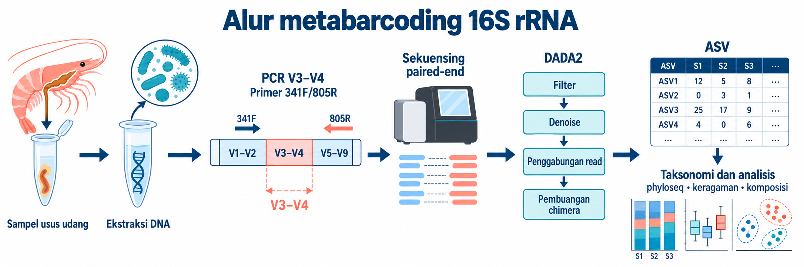

.](https://www.globalseafood.org/wp-content/uploads/2020/08/ARANGUREN-Pic-0_960.jpg){.content-image .article-hero-image fig-alt="Udang vanamei sehat dan terinfeksi AHPND"}

## Daftar isi

1.  [Apa itu metabarcoding 16S?](#apa-itu-metabarcoding-16s)
2.  [Desain studi dan data](#desain-studi-data)
3.  [Inspeksi *raw reads*](#inspeksi-raw-reads)
4.  [Kendali mutu dan pemangkasan primer](#qc-pemangkasan-primer)
5.  [Denoising menjadi ASV dengan DADA2](#denoising-menjadi-asv-dengan-dada2)
6.  [Penugasan taksonomi](#penugasan-taksonomi)
7.  [Membangun objek phyloseq](#membangun-objek-phyloseq)
8.  [Analisis komunitas mikroba](#analisis-komunitas-mikroba)
9.  [Hal yang perlu dipertimbangkan](#apa-yang-perlu-dipertimbangkan)

## Apa itu metabarcoding 16S? {#apa-itu-metabarcoding-16s}

### Gen 16S rRNA sebagai penanda taksonomi

Gen 16S rRNA mengode bagian dari subunit kecil ribosom prokariot. Panjangnya sekitar 1.500 basa dan memuat daerah lestari serta sembilan daerah hipervariabel, V1 sampai V9. Primer PCR menempel pada daerah lestari, sedangkan variasi pada daerah hipervariabel membantu membedakan takson.

Tutorial ini menargetkan V3–V4. Pada eksperimen nyata, pasangan primer 341F/805R menghasilkan amplikon sekitar 460 bp yang sesuai untuk sekuensing *paired-end* Illumina. Data demo dipersingkat menjadi amplikon 400 bp agar seluruh analisis dapat dijalankan dengan cepat.

{.content-image fig-alt="Alur metabarcoding 16S rRNA"}

Alurnya dimulai dari ekstraksi DNA, amplifikasi V3–V4, lalu sekuensing. Setelah primer dan *reads* berkualitas rendah dibuang, DADA2 memisahkan kesalahan sekuensing dari variasi biologis dan menghasilkan ASV (*amplicon sequence variant*). Setiap ASV kemudian dibandingkan dengan basis data referensi untuk menentukan taksonominya.

Metabarcoding 16S hanya membaca satu penanda genetik. Biayanya lebih rendah dan cocok untuk membandingkan komunitas bakteri serta arkea, tetapi biasanya berhenti pada resolusi genus dan tidak mengukur gen fungsional secara langsung. Sebaliknya, *shotgun metagenomics* membaca seluruh DNA dalam sampel sehingga dapat memberi resolusi dan informasi fungsi yang lebih tinggi, dengan kebutuhan data dan biaya yang juga lebih besar.

### Kegunaan dalam akuakultur

Komunitas mikroba usus, air, dan sedimen dapat berubah bersama kondisi inang dan lingkungan budidaya. Metabarcoding 16S membantu membandingkan perubahan tersebut, menyaring kandidat takson yang terkait dengan penyakit, serta menilai respons terhadap pakan atau pengelolaan air.

Namun, data 16S menunjukkan asosiasi, bukan sebab-akibat. Peningkatan suatu genus pada udang sakit belum membuktikan bahwa genus itu menyebabkan penyakit. Kesimpulan biologis tetap memerlukan desain eksperimen, kontrol, pengukuran lingkungan, dan validasi tambahan.

## Desain studi dan data {#desain-studi-data}

Tutorial ini memakai 20 sampel usus udang vanamei (*Litopenaeus vannamei*): 10 sampel sehat dan 10 sampel AHPND. Skenario eksperimennya menggunakan primer 341F (`5'-CCTACGGGNGGCWGCAG-3'`) dan 805R (`5'-GACTACHVGGGTATCTAATCC-3'`) dengan sekuensing *paired-end*. Agar ringan, berkas demo menyimpan *read forward* 232 basa dan *read reverse* 236 basa, termasuk primer. Setelah primer dipotong, masing-masing pasangan menyisakan 215 basa dan mempunyai overlap 30 basa pada amplikon 400 bp.

Data ini sintetis dan dibuat dengan `code/generate-metabarcoding-16s-demo.R`. Komposisi kedua kelompok sengaja dibedakan agar setiap tahap analisis menghasilkan pola yang mudah dibaca. Karena itu, hasil di bawah menjelaskan perilaku pipeline, bukan bukti biologis tentang AHPND. Berkas unduhan tersedia untuk menjalankan ulang tutorial.

::: download-row
[⬇ *Raw reads* — 20 sampel *paired-end*, .tar.gz](data/metabarcoding-16s-demo/metabarcoding-16s-raw-reads.tar.gz){.btn-download download="metabarcoding-16s-raw-reads.tar.gz"}

[⬇ Metadata sampel — metadata.csv](data/metabarcoding-16s-demo/metadata.csv){.btn-download download="metadata.csv"}

[⬇ Basis data taksonomi — train_set_demo.fa.gz](data/metabarcoding-16s-demo/ref/train_set_demo.fa.gz){.btn-download download="train_set_demo.fa.gz"}
:::

## Inspeksi *raw reads* {#inspeksi-raw-reads}

Langkah pertama adalah mencocokkan berkas *forward* dan *reverse*, mengambil nama sampel, lalu menghitung jumlah *reads*. Pemeriksaan ini segera menunjukkan berkas yang hilang atau pola nama yang tidak konsisten.

```{r}
#| label: setup-paths
#| warning: false
#| message: false
# Temukan pasangan FASTQ dan hitung reads forward pada setiap sampel.
suppressMessages({library(dada2); library(ggplot2)})
reads_dir <- "data/metabarcoding-16s-demo/raw_reads"
fnFs <- sort(list.files(reads_dir, pattern = "_1.fastq.gz$", full.names = TRUE))
fnRs <- sort(list.files(reads_dir, pattern = "_2.fastq.gz$", full.names = TRUE))
sample_names <- sub("_1.fastq.gz$", "", basename(fnFs))
data.frame(sample = sample_names,
           reads = sapply(fnFs, function(f) length(ShortRead::readFastq(f)))) |> head()
```

Semua 20 pasangan berkas terbaca. Totalnya 40.086 pasangan, dengan 1.919–2.062 pasangan per sampel dan rata-rata 2.004. Jumlah ini kecil karena data dibuat untuk latihan. Pada studi nyata, kedalaman yang dibutuhkan bergantung pada keragaman komunitas dan tujuan analisis. Penjelasan format FASTQ tersedia pada artikel [Mengenal berbagai format file NGS](teknis-file-format.qmd).

## Kendali mutu dan pemangkasan primer {#qc-pemangkasan-primer}

Primer PCR harus dibuang sebelum DADA2 mempelajari pola kesalahan. Untuk data nyata, `cutadapt` dapat mencari primer lengkap, termasuk kode degenerasi IUPAC, lalu memangkasnya. Perintah berikut adalah alternatif dan tidak dijalankan dalam alur utama artikel.

``` bash
# Pangkas primer IUPAC dari satu pasangan FASTQ dengan cutadapt.
cutadapt -g CCTACGGGNGGCWGCAG -G GACTACHVGGGTATCTAATCC \
  -o trimmed_1.fastq.gz -p trimmed_2.fastq.gz sample_1.fastq.gz sample_2.fastq.gz
```

Perintah tersebut diuji dengan `cutadapt` 5.2 pada sampel AH01. Primer terdeteksi pada 99,7% *forward reads* dan 99,9% *reverse reads*. Jika hasil `cutadapt` dipakai sebagai masukan DADA2, jangan memangkas primer lagi dengan `trimLeft`.

Data demo memiliki primer pada posisi tetap, jadi alur utama memakai `trimLeft = c(17, 21)`. Filter juga menolak *reads* dengan basa ambigu, membatasi *expected error* maksimal dua pada tiap arah, dan memotong ekor setelah kualitas turun ke Q2. `rm.phix = FALSE` dipakai karena data sintetis ini tidak memuat PhiX.

```{r}
#| label: filter-trim
#| warning: false
#| message: false
# Pangkas primer dan saring pasangan reads berdasarkan kualitas.
filtFs <- file.path("data/metabarcoding-16s-demo/filtered", paste0(sample_names, "_F.fastq.gz"))
filtRs <- file.path("data/metabarcoding-16s-demo/filtered", paste0(sample_names, "_R.fastq.gz"))
names(filtFs) <- sample_names; names(filtRs) <- sample_names
out <- filterAndTrim(fnFs, filtFs, fnRs, filtRs,
                     trimLeft   = c(17, 21),
                     truncLen    = 0,
                     maxN        = 0,
                     maxEE       = c(2, 2),
                     truncQ      = 2,
                     rm.phix     = FALSE,
                     compress    = TRUE,
                     multithread = TRUE)
head(out)
```

Sebanyak 30.932 dari 40.086 pasangan lolos, setara dengan retensi 77,16%. Retensi per sampel berkisar 75,80–79,17%, sehingga tidak ada satu sampel yang kehilangan *reads* secara mencolok. Sekitar 23% pasangan tersaring karena generator data sengaja menambahkan profil kualitas rendah. Pada data nyata, kehilangan besar atau tidak merata perlu diperiksa melalui profil kualitas, panjang pemotongan, dan batas `maxEE`.

## Denoising menjadi ASV dengan DADA2 {#denoising-menjadi-asv-dengan-dada2}

DADA2 mempelajari hubungan antara skor kualitas dan kesalahan, lalu mengoreksi *reads* menjadi ASV. Setelah *forward* dan *reverse reads* diproses terpisah, keduanya digabungkan melalui overlap 30 basa. Tahap terakhir membuang chimera, yaitu artefak PCR yang tersusun dari bagian dua atau lebih sekuens induk.

```{r}
#| label: dada-denoise
#| warning: false
#| message: false
#| code-fold: true
#| code-summary: "Kode DADA2, dari pemodelan error hingga tabel ASV"
# Pelajari error, denoise, gabungkan pasangan, lalu buang chimera.
set.seed(100)
errF <- learnErrors(filtFs, multithread = TRUE, verbose = 0)
errR <- learnErrors(filtRs, multithread = TRUE, verbose = 0)
dadaFs <- dada(filtFs, err = errF, multithread = TRUE, verbose = 0)
dadaRs <- dada(filtRs, err = errR, multithread = TRUE, verbose = 0)
merged <- mergePairs(dadaFs, filtFs, dadaRs, filtRs, verbose = FALSE)
seqtab <- makeSequenceTable(merged)
seqtab.nochim <- removeBimeraDenovo(seqtab, method = "consensus",
                                    multithread = TRUE, verbose = FALSE)
cat("jumlah ASV:", ncol(seqtab.nochim),
    " | rentang panjang:", paste(range(nchar(getSequences(seqtab.nochim))), collapse = "-"), "\n")
```

Pipeline menghasilkan 20 ASV, semuanya sepanjang 400 bp. Angka ini sama dengan jumlah sekuens referensi yang dimasukkan oleh generator data. Kesamaan tersebut adalah hasil rancangan simulasi, bukan tolok ukur yang perlu dicapai pada data nyata.

```{r}
#| label: track-reads
# Ringkas jumlah reads yang bertahan pada setiap tahap DADA2.
getN <- function(x) sum(getUniques(x))
track <- cbind(out,
               denoisedF = sapply(dadaFs, getN),
               denoisedR = sapply(dadaRs, getN),
               merged    = sapply(merged, getN),
               nonchim   = rowSums(seqtab.nochim))
colnames(track)[1:2] <- c("input", "filtered")
head(track)
```

Tahap akhir mempertahankan 30.723 pasangan, atau 76,64% dari input. Sebanyak 99,32% pasangan yang lolos filter mencapai tabel non-chimera. Dalam demo ini tidak ada pasangan tambahan yang hilang saat chimera dibuang. Pada data nyata, tabel pelacakan membantu menemukan apakah kehilangan terbesar terjadi saat filter, *denoising*, penggabungan, atau pembuangan chimera.

## Penugasan taksonomi {#penugasan-taksonomi}

`assignTaxonomy` membandingkan pola *k-mer* setiap ASV dengan basis data referensi menggunakan pengklasifikasi *naive* Bayes. Tutorial ini memakai basis data kecil yang dibangun khusus untuk 20 sekuens demo. Analisis nyata memerlukan basis data yang sesuai dengan primer dan organisme target, misalnya SILVA, GTDB, atau RDP.

```{r}
#| label: assign-tax
#| warning: false
#| message: false
# Tetapkan taksonomi ASV dengan basis data referensi demo.
taxa <- assignTaxonomy(seqtab.nochim,
                       "data/metabarcoding-16s-demo/ref/train_set_demo.fa.gz",
                       taxLevels = c("Kingdom","Phylum","Class","Order","Family","Genus"),
                       minBoot = 50, multithread = TRUE)
as.data.frame(unname(taxa)) |>
  setNames(c("Kingdom","Phylum","Class","Order","Family","Genus")) |>
  head()
```

Enam ASV pertama ditetapkan sebagai *Vibrio*, *Photobacterium*, *Phaeobacter*, *Ruegeria*, *Tenacibaculum*, dan *Shewanella*. Semua ASV demo mendapat nama genus karena basis datanya dibuat dari sekuens yang sama. Pada data lapangan, sebagian ASV biasanya berhenti pada famili atau orde dan berisi `NA` pada peringkat yang lebih rendah.

## Membangun objek phyloseq {#membangun-objek-phyloseq}

Objek phyloseq menyatukan tabel hitungan, metadata, taksonomi, dan sekuens ASV. Penyatuan ini menjaga nama sampel dan takson tetap selaras pada analisis berikutnya.

```{r}
#| label: build-phyloseq
#| warning: false
#| message: false
# Gabungkan hitungan, metadata, taksonomi, dan sekuens dalam satu objek.
suppressMessages({library(phyloseq); library(Biostrings)})
meta <- read.csv("data/metabarcoding-16s-demo/metadata.csv", row.names = 1)
ps <- phyloseq(otu_table(seqtab.nochim, taxa_are_rows = FALSE),
               sample_data(meta),
               tax_table(taxa))
dna <- DNAStringSet(taxa_names(ps)); names(dna) <- taxa_names(ps)
ps <- merge_phyloseq(ps, dna)
taxa_names(ps) <- paste0("ASV", seq_len(ntaxa(ps)))
sample_data(ps)$group <- factor(sample_data(ps)$group, levels = c("sehat","AHPND"))
ps
```

Ringkasan objek mengonfirmasi adanya 20 takson, 20 sampel, satu variabel metadata, enam peringkat taksonomi, dan 20 sekuens referensi. Objek `ps` menjadi sumber tunggal untuk visualisasi dan pengujian statistik di bawah.

## Analisis komunitas mikroba {#analisis-komunitas-mikroba}

Analisis berikut melihat keragaman dalam sampel, kecukupan kedalaman baca, komposisi genus, perbedaan antarsampel, pola kelimpahan, dan genus yang berbeda di antara kelompok. Karena datanya sintetis, pembahasan berfokus pada cara membaca output.

### Keragaman alfa dalam sampel {#alpha-diversity}

`Observed` menghitung jumlah ASV yang terdeteksi. Indeks Shannon juga memperhitungkan pemerataan kelimpahan, sehingga nilainya turun ketika sedikit takson mendominasi komunitas.

```{r}
#| label: fig-alpha
#| fig-cap: "Indeks Observed dan Shannon pada setiap kelompok dalam data demo."
#| fig-width: 7
#| fig-height: 4.5
#| warning: false
#| message: false
# Bandingkan kekayaan ASV dan indeks Shannon antar kelompok.
plot_richness(ps, x = "group", color = "group",
              measures = c("Observed","Shannon")) +
  geom_boxplot(alpha = 0.25, outlier.shape = NA) +
  scale_color_manual(values = c(sehat = "#2c7fb8", AHPND = "#c0392b")) +
  theme_minimal(base_size = 12) + theme(legend.position = "none")
```

Kelompok sehat memiliki median 17,5 ASV dan Shannon 2,495. Pada kelompok AHPND, median tersebut turun menjadi 12,5 ASV dan Shannon 1,723. Rentang Shannon kedua kelompok juga tidak bertumpang tindih: 2,136–2,617 pada kelompok sehat dan 1,479–1,981 pada AHPND. Pola kuat ini memang ditanamkan dalam data sintetis.

Peringatan `estimate_richness` tentang tidak adanya *singleton* juga perlu diperhatikan. Data demo hanya memuat 20 takson rancangan, sehingga estimasi kekayaannya tidak mewakili komunitas alami. Pada data nyata, hitung keragaman dari tabel yang belum membuang takson berkelimpahan rendah tanpa alasan yang jelas.

```{r}
#| label: alpha-test
#| warning: false
#| message: false
# Uji perbedaan indeks Shannon dengan Wilcoxon rank-sum.
rich <- estimate_richness(ps, measures = c("Observed","Shannon"))
rich$group <- sample_data(ps)$group
wilcox.test(Shannon ~ group, data = rich)
```

Uji Wilcoxon menghasilkan `W = 100` dan `p = 1,08 × 10^-5`. Di bawah hipotesis nol bahwa distribusi Shannon sama pada kedua kelompok, statistik setidaknya se-ekstrem ini jarang muncul. Hasil tersebut mendukung perbedaan pada data demo, tetapi tidak mengubah data sintetis menjadi bukti klinis.

### Kurva rarefaction {#kurva-rarefaction}

Kurva *rarefaction* menunjukkan berapa banyak ASV yang teramati saat jumlah *reads* bertambah. Kurva yang mulai mendatar menunjukkan bahwa tambahan *reads* hanya menemukan sedikit ASV baru.

```{r}
#| label: fig-rarefaction
#| fig-cap: "Kekayaan ASV terhadap jumlah reads yang disubsampel."
#| fig-width: 7
#| fig-height: 4.5
#| warning: false
#| message: false
# Gambar kurva rarefaction untuk menilai kejenuhan kekayaan ASV.
suppressMessages(library(vegan))
otu_mat <- as(otu_table(ps), "matrix")
if (taxa_are_rows(ps)) otu_mat <- t(otu_mat)
cols <- ifelse(sample_data(ps)$group == "AHPND", "#c0392b", "#2c7fb8")
rarecurve(otu_mat, step = 50, col = cols, label = FALSE,
          xlab = "jumlah reads", ylab = "jumlah ASV")
legend("bottomright", legend = c("sehat","AHPND"),
       col = c("#2c7fb8","#c0392b"), lty = 1, bty = "n")
```

Semua kurva mendekati plateau sebelum kedalaman maksimum. Untuk 20 takson yang ditanamkan dalam demo, sekitar 1.500 *reads* per sampel sudah menangkap sebagian besar kekayaan yang tersedia. Garis AHPND berhenti pada jumlah ASV yang lebih rendah, sesuai dengan komposisi yang sengaja dibuat lebih timpang.

### Komposisi taksonomi {#komposisi-taksonomi}

ASV diagregasi ke tingkat genus, lalu setiap hitungan dibagi total *reads* sampelnya. Hasilnya adalah proporsi, bukan jumlah sel absolut.

```{r}
#| label: fig-composition
#| fig-cap: "Kelimpahan relatif genus pada setiap sampel demo."
#| fig-width: 8
#| fig-height: 5
#| warning: false
#| message: false
# Agregasikan ASV ke genus dan ubah hitungan menjadi proporsi per sampel.
ps_genus <- tax_glom(ps, taxrank = "Genus", NArm = FALSE)
ps_rel   <- transform_sample_counts(ps_genus, function(x) x / sum(x))
plot_bar(ps_rel, x = "Sample", fill = "Genus") +
  facet_wrap(~ group, scales = "free_x", nrow = 1) +
  labs(x = NULL, y = "kelimpahan relatif") +
  theme_minimal(base_size = 11) +
  theme(axis.text.x = element_text(angle = 90, vjust = 0.5, size = 6),
        legend.key.size = unit(0.35, "cm"), legend.text = element_text(size = 7))
```

Pada kelompok sehat, rerata proporsi tertinggi berasal dari *Phaeobacter* (16,8%), *Ruegeria* (11,9%), dan *Shewanella* (9,5%). Pada AHPND, *Vibrio* mencapai 38,3% dan *Photobacterium* 24,6%, diikuti *Tenacibaculum* 8,4% dan *Aliivibrio* 7,9%. Perbedaan ini sesuai dengan parameter generator data dan tidak boleh dibaca sebagai estimasi prevalensi pada populasi udang.

### Keragaman beta antarsampel {#beta-diversity}

Jarak Bray–Curtis merangkum perbedaan komposisi antarsampel. PCoA kemudian memproyeksikan jarak tersebut ke dua sumbu agar pola kelompok dapat dilihat.

```{r}
#| label: fig-beta
#| fig-cap: "PCoA berbasis jarak Bray–Curtis pada kelimpahan relatif."
#| fig-width: 6.5
#| fig-height: 5
#| warning: false
#| message: false
# Hitung PCoA dan gambar posisi sampel menurut kelompok.
ps_relA <- transform_sample_counts(ps, function(x) x / sum(x))
ord <- ordinate(ps_relA, method = "PCoA", distance = "bray")
ord_df <- as.data.frame(ord$vectors[, 1:2])
colnames(ord_df) <- c("PCoA1", "PCoA2")
ord_df$group <- factor(as.character(sample_data(ps_relA)$group)[
                         match(rownames(ord_df), sample_names(ps_relA))],
                       levels = c("sehat", "AHPND"))
ggplot(ord_df, aes(PCoA1, PCoA2, color = group, shape = group)) +
  stat_ellipse(type = "norm", linetype = 2, linewidth = 0.7) +
  geom_point(size = 4, alpha = 0.9) +
  scale_color_manual(values = c(sehat = "#2c7fb8", AHPND = "#c0392b")) +
  scale_shape_manual(values = c(sehat = 16, AHPND = 17)) +
  labs(x = "PCoA 1", y = "PCoA 2") +
  theme_minimal(base_size = 13) +
  theme(legend.position = "right", legend.title = element_blank())
```

Titik sehat dan AHPND membentuk dua kelompok yang terpisah pada PCoA. Plot ini menunjukkan pola jarak, tetapi belum menjelaskan apakah pemisahan berasal dari perbedaan pusat kelompok, perbedaan sebaran, atau keduanya.

PERMANOVA menguji hubungan komposisi dengan kelompok. Uji dispersi dijalankan sesudahnya karena PERMANOVA dapat ikut sensitif terhadap perbedaan keragaman jarak di dalam kelompok.

```{r}
#| label: permanova
#| warning: false
#| message: false
# Uji perbedaan komposisi dan kesamaan dispersi antarkelompok.
bc <- phyloseq::distance(ps_relA, method = "bray")
set.seed(200)
adonis2(bc ~ group, data = data.frame(sample_data(ps_relA)), permutations = 999)
set.seed(200)
permutest(betadisper(bc, sample_data(ps_relA)$group), permutations = 999)
```

PERMANOVA menghasilkan `R² = 0,609`, `F = 28,08`, dan `p = 0,001`. Dalam data demo, kelompok menjelaskan sekitar 60,9% variasi jarak Bray–Curtis. Namun, uji dispersi juga signifikan (`F = 12,84`; `p = 0,002`). Artinya, sebaran sampel di dalam kelompok tidak sama dan dapat berkontribusi pada hasil PERMANOVA. Kesimpulan yang aman adalah kedua kelompok demo berbeda dalam struktur komunitas, mencakup posisi dan/atau dispersi; hasil ini tidak boleh ditafsirkan hanya sebagai pergeseran pusat kelompok.

### Heatmap kelimpahan {#heatmap-kelimpahan}

Heatmap menampilkan 15 genus dengan total hitungan terbesar. Sampel dipisah menurut kelompok, sedangkan genus diurutkan menurut total kelimpahan. Kode ini tidak melakukan *clustering* hierarkis.

```{r}
#| label: fig-heatmap
#| fig-cap: "Kelimpahan relatif 15 genus teratas, dipisah menurut kelompok."
#| fig-width: 8
#| fig-height: 5
#| warning: false
#| message: false
# Susun heatmap genus teratas tanpa clustering hierarkis.
suppressMessages(library(tidyr))
top <- names(sort(taxa_sums(ps_genus), decreasing = TRUE))[1:15]
ps_top <- transform_sample_counts(prune_taxa(top, ps_genus), function(x) x / sum(x))
mat <- as(otu_table(ps_top), "matrix"); if (!taxa_are_rows(ps_top)) mat <- t(mat)
rownames(mat) <- as.character(tax_table(ps_top)[rownames(mat), "Genus"])
grp <- as.character(sample_data(ps_top)$group); names(grp) <- sample_names(ps_top)
long <- as.data.frame(as.table(mat))
colnames(long) <- c("Genus", "Sample", "abundance")
long$group <- factor(grp[as.character(long$Sample)], levels = c("sehat","AHPND"))
long$Genus <- factor(long$Genus, levels = names(sort(rowSums(mat))))
ggplot(long, aes(Sample, Genus, fill = abundance)) +
  geom_tile(color = "white", linewidth = 0.15) +
  facet_grid(~ group, scales = "free_x", space = "free_x") +
  scale_fill_gradient(low = "#f7f7f7", high = "#6f42c1", name = "kelimpahan\nrelatif") +
  labs(x = NULL, y = NULL) +
  theme_minimal(base_size = 11) +
  theme(axis.text.x = element_blank(), axis.ticks.x = element_blank(),
        panel.grid = element_blank(), strip.text = element_text(face = "bold"))
```

Panel AHPND memperlihatkan kelimpahan tinggi *Vibrio* dan *Photobacterium* pada hampir semua sampel. Panel sehat lebih menonjolkan *Phaeobacter*, *Ruegeria*, dan *Shewanella*. Heatmap berguna untuk melihat konsistensi pola antarsampel, tetapi intensitas warnanya tetap kelimpahan relatif.

### Kelimpahan diferensial dengan DESeq2 {#kelimpahan-diferensial}

DESeq2 memodelkan hitungan genus dengan distribusi binomial negatif. Karena banyak nilai nol, faktor ukuran dihitung memakai *geometric mean* dari hitungan positif. Kontras `AHPND` terhadap `sehat` membuat nilai *log2 fold change* positif berarti lebih tinggi pada AHPND.

Metode ini praktis untuk demonstrasi, tetapi data mikrobioma bersifat komposisional. Untuk analisis utama pada data nyata, bandingkan hasilnya dengan metode yang dirancang untuk data komposisional, seperti ANCOM-BC atau ALDEx2, dan perhitungkan desain eksperimen serta kovariat yang relevan.

```{r}
#| label: fig-diffabund
#| fig-cap: "Genus dengan padj < 0,05 pada perbandingan AHPND terhadap sehat."
#| fig-width: 7
#| fig-height: 4.5
#| warning: false
#| message: false
#| code-fold: true
#| code-summary: "Kode DESeq2 untuk kelimpahan diferensial"
# Normalisasi hitungan, jalankan DESeq2, lalu plot genus signifikan.
suppressMessages(library(DESeq2))
dds <- phyloseq_to_deseq2(ps_genus, ~ group)
gm_mean <- function(x) exp(sum(log(x[x > 0])) / length(x))
geoMeans <- apply(counts(dds), 1, gm_mean)
dds <- estimateSizeFactors(dds, geoMeans = geoMeans)
dds <- DESeq(dds, fitType = "local", quiet = TRUE)
res <- results(dds, contrast = c("group","AHPND","sehat"))
res_df <- as.data.frame(res)
res_df$Genus <- as.character(tax_table(ps_genus)[rownames(res_df), "Genus"])
sig <- subset(res_df, !is.na(padj) & padj < 0.05)
sig <- sig[order(sig$log2FoldChange), ]
sig$Genus <- factor(sig$Genus, levels = sig$Genus)
ggplot(sig, aes(log2FoldChange, Genus, fill = log2FoldChange > 0)) +
  geom_col() +
  scale_fill_manual(values = c("FALSE" = "#2c7fb8", "TRUE" = "#c0392b"), guide = "none") +
  labs(x = "log2 fold change (AHPND vs sehat)", y = NULL) +
  theme_minimal(base_size = 12)
```

Delapan genus memiliki `padj < 0,05`. *Vibrio*, *Photobacterium*, *Aliivibrio*, dan *Tenacibaculum* lebih tinggi pada AHPND, sedangkan *Bacillus*, *Shewanella*, *Phaeobacter*, dan *Pseudoalteromonas* lebih tinggi pada kelompok sehat. *Vibrio* memiliki `log2 fold change = 4,17` dan *Photobacterium* 5,08. Nilai ini menggambarkan perbedaan yang ditanamkan dalam simulasi; genus tersebut adalah kandidat untuk validasi, bukan penanda penyakit yang telah terbukti.

## Hal yang perlu dipertimbangkan {#apa-yang-perlu-dipertimbangkan}

### Primer dan daerah target

Setiap pasangan primer mempunyai bias cakupan. Pilih daerah 16S berdasarkan organisme target, panjang baca, dan resolusi yang dibutuhkan. Uji primer secara *in silico* dan catat versi serta urutannya agar analisis dapat direproduksi.

### Jumlah salinan gen 16S

Jumlah salinan gen 16S berbeda antartakson. Kelimpahan relatif *reads* karena itu tidak sama dengan proporsi sel. Koreksi berbasis basis data jumlah salinan dapat membantu, tetapi juga membawa ketidakpastian baru.

### Kontrol negatif dan kontaminasi

Sertakan blanko ekstraksi dan blanko PCR pada setiap *batch*. Kontaminan reagen dapat mendominasi sampel berbiomassa rendah, sehingga kontrol harus diproses dan dianalisis bersama sampel utama.

### Kedalaman sekuensing

Kurva *rarefaction* membantu memeriksa apakah kekayaan mulai jenuh, tetapi bukan aturan tunggal untuk menentukan kedalaman cukup. Hindari menyamakan kedalaman dengan *subsampling* tanpa menilai konsekuensi hilangnya data dan tujuan analisis.

### Sifat komposisional

Setiap nilai bergantung pada total *reads* sampel. Kenaikan proporsi satu takson dapat membuat proporsi takson lain turun meski jumlah absolutnya tetap. Gunakan metode yang sesuai untuk data komposisional dan, bila memungkinkan, tambahkan ukuran beban mikroba absolut.

### Batas resolusi taksonomi

Amplicon 16S umumnya lebih andal pada tingkat genus daripada spesies atau strain. Jika pertanyaan penelitian memerlukan identifikasi strain, gen virulensi, virus, fungi, atau jalur metabolik, gunakan metode lain seperti *shotgun metagenomics*.

## Penutup

Pipeline ini mengubah 40.086 pasangan *raw reads* menjadi tabel 20 ASV, menghubungkannya dengan taksonomi dan metadata, lalu membandingkan dua kelompok demo. DADA2 mempertahankan 30.723 pasangan sampai tahap akhir. Analisis lanjutan menemukan Shannon yang lebih rendah pada AHPND, pemisahan Bray–Curtis yang disertai perbedaan dispersi, dan delapan genus dengan kelimpahan berbeda menurut DESeq2.

Hasil tersebut menunjukkan bahwa kode bekerja sesuai rancangan data sintetis. Pada penelitian nyata, kesimpulan harus mempertimbangkan kontrol kontaminasi, struktur desain, variasi dispersi, sifat komposisional, dan validasi biologis. Untuk melihat analisis ekspresi gen inang pada skenario yang sama, lanjutkan ke [RNA-Seq workflow](work-RNA-seq.qmd).