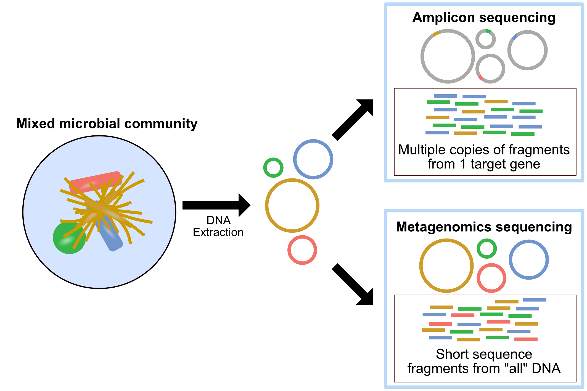

<p style="text-align: right; font-size: 0.9rem;">
  <a href="../index.qmd" style="font-weight: bold;">← Beranda</a>
  &nbsp;&nbsp;|&nbsp;&nbsp;
  <a href="../materi.qmd" style="font-weight: bold;">Pilih materi →</a>
</p>

<h1 style="text-align: center; font-size: 2.5rem; font-weight: bold; margin-bottom: 0.5rem;">
  <a href="work-metagenomics.qmd" style="text-decoration: none; color: inherit;">
    Metagenomik 16S rRNA
  </a>
</h1>

<p style="text-align: center; font-size: 1.2rem;">
  Oleh <a href="bio.qmd" target="_blank">Agus Wibowo</a>
</p>

<figure style="text-align: center; margin-bottom: 1.5rem;">
  
  <figcaption style="font-size: 0.9em; margin-top: 8px; color: #666;">
    Udang vanamei (<em>Litopenaeus vannamei</em>) pada sistem budidaya intensif. Gambar atas dan bawah masing-masing adalah udang sehat dan yang terinfeksi AHPND.
    <br><em>Sumber gambar</em> <a href="https://www.globalseafood.org/advocate/the-role-of-vibrio-in-shrimp-aquaculture/" target="_blank">Global Seafood Alliance</a>.
  </figcaption>
</figure>

# Daftar isi

1.  [Apa itu metagenomik 16S?](#apa-itu-metagenomik-16s)
2.  [Desain studi dan data](#desain-studi-data)
3.  [Inspeksi raw reads](#inspeksi-raw-reads)
4.  [Kendali mutu dan pemangkasan primer](#qc-pemangkasan-primer)
5.  [Denoising menjadi ASV dengan DADA2](#denoising-menjadi-asv-dengan-dada2)
6.  [Penugasan taksonomi](#penugasan-taksonomi)
7.  [Membangun objek phyloseq](#membangun-objek-phyloseq)
8.  [Analisis komunitas mikroba](#analisis-komunitas-mikroba)
9.  [Apa yang perlu dipertimbangkan](#apa-yang-perlu-dipertimbangkan)

# Apa itu metagenomik 16S?

## Gen 16S rRNA sebagai penanda taksonomi

Di setiap sel bakteri terdapat subunit ribosom kecil yang mengandung molekul RNA berukuran sekitar 1.500 pasang basa, yang dikenal sebagai 16S rRNA. Gen yang mengkodenya sangat istimewa karena strukturnya tersusun dari daerah-daerah lestari (*conserved*) yang sangat terjaga di seluruh kehidupan prokariot dan diapit oleh sembilan daerah hipervariabel bernama V1 hingga V9. Daerah lestari berfungsi sebagai dermaga bagi *primer* PCR yang mampu menempel hampir di semua bakteri, sementara daerah hipervariabel bertindak seperti sidik jari khas tiap takson. Pada tutorial ini kita menargetkan wilayah V3 dan V4 karena kombinasinya memberikan resolusi taksonomi yang baik hingga tingkat *genus* sekaligus menghasilkan amplikon sepanjang sekitar 460 pasang basa, panjang yang ideal untuk *sequencing paired-end* Illumina. Khusus pada data demo tutorial ini, panjang amplikon sengaja disederhanakan menjadi 400 bp agar ringan dijalankan.

<figure style="text-align: center; margin: 1.5rem 0;">
  
  <figcaption style="font-size: 0.9em; margin-top: 8px; color: #666;">
    Gambaran umum alur kerja metagenomik, mulai dari pengambilan sampel dan ekstraksi DNA, amplifikasi serta <em>sequencing</em>, hingga analisis komunitas mikroba secara komputasional.
  </figcaption>
</figure>

Alur kerja *metabarcoding* 16S dimulai dari pengambilan sampel dan ekstraksi DNA total, lalu amplifikasi daerah V3 dan V4 dengan PCR memakai *primer* universal. Amplikon yang dihasilkan kemudian di-*sequencing* secara massal. Setelah melewati tahap kendali mutu dan pemotongan *primer*, *reads* yang tersisa dikelompokkan menjadi satuan biologis bernama ASV (*Amplicon Sequence Variant*) atau OTU (*Operational Taxonomic Unit*). ASV yang dihasilkan oleh metode *denoising* seperti DADA2 merupakan satuan beresolusi tinggi karena mewakili urutan biologis yang tepat tanpa ambiguitas *clustering*. Setiap ASV lalu dibandingkan dengan basis data referensi seperti SILVA untuk memperoleh identitas taksonominya.

## Metabarcoding 16S dibandingkan sekuensing shotgun

Dua pendekatan utama dalam metagenomik memiliki profil kelebihan dan kekurangan yang berbeda. Pendekatan *metabarcoding* amplikon 16S berbiaya rendah, hanya membutuhkan sedikit *reads* karena 10.000 sampai 50.000 *reads* per sampel sudah informatif, dan memberikan resolusi taksonomi hingga tingkat *genus* atau kadang *species* untuk bakteri serta *archaea*, walaupun tidak mampu mendeteksi virus, fungi, maupun jalur metabolik secara langsung. Sebaliknya, *shotgun metagenomics* berbiaya lebih tinggi dan membutuhkan jutaan *reads* per sampel, namun mampu memberikan resolusi hingga tingkat *species* atau *strain* sekaligus mengungkap potensi fungsional berupa gen dan *pathway* metabolik, dan mencakup seluruh domain kehidupan termasuk virus dan fungi.

Untuk studi komunitas bakteri dalam konteks kesehatan organisme budidaya, pendekatan amplikon 16S umumnya menjadi pilihan pertama karena efisiensi biaya dan kemampuannya menangani banyak sampel dalam satu *run* sekuensing.

## Relevansi untuk akuakultur

Sistem budidaya intensif menciptakan tekanan biologis yang tidak sederhana sehingga kesehatan hewan budidaya tidak hanya bergantung pada genotipe inang atau kualitas air, tetapi juga pada ekosistem mikroba di dalam dan sekitarnya. Mikrobioma usus udang dan ikan berperan aktif dalam pencernaan nutrisi, stimulasi sistem imun mukosa, serta produksi metabolit antimikroba yang menekan pertumbuhan patogen. Di tambak, komunitas mikroba air dan sedimen membentuk sabuk pengaman ekologis yang memengaruhi ketersediaan nutrisi sekaligus laju proliferasi bakteri oportunistik.

Ketika terjadi *disbiosis*, yaitu ketidakseimbangan komposisi komunitas mikroba, sistem pertahanan ini melemah dan pintu terbuka bagi infeksi. Pada penyakit seperti *Vibriosis*, *Early Mortality Syndrome* (EMS), maupun AHPND, pergeseran dramatis komposisi mikrobioma usus sering mendahului tanda-tanda klinis yang terlihat. Hal inilah yang menjadikan metagenomik 16S sebagai alat yang sangat berharga karena kemampuannya mendeteksi perubahan komposisi komunitas mikroba dengan cepat dan biaya terjangkau membuka peluang untuk deteksi dini patogen, pemilihan kandidat probiotik yang tepat, serta evaluasi dampak perubahan manajemen pakan atau kualitas air terhadap kesehatan usus secara menyeluruh.

# Desain studi dan data {#desain-studi-data}

## Skenario mikrobioma usus udang vanamei sehat dan AHPND

Tutorial ini menggunakan skenario yang dirancang untuk melengkapi studi transkriptomik yang sudah dibahas pada [RNA-Seq workflow](work-RNA-seq.qmd). Di sana kita menelusuri respon ekspresi gen hepatopankreas udang vanamei (*Litopenaeus vannamei*) saat terinfeksi toksin Pir A/B dari *Vibrio* penyebab AHPND. Kini kita mendekati sistem yang sama dari sudut pandang berbeda, bukan ekspresi gen inang melainkan komunitas mikroba yang menghuni usus udang tersebut.

Dataset tutorial ini terdiri dari 20 sampel usus udang vanamei, yaitu 10 sampel dari udang sehat tanpa tanda klinis dan 10 sampel dari udang yang terdiagnosis AHPND berdasarkan histopatologi hepatopankreas. DNA total diekstraksi dari isi usus memakai protokol *bead-beating* standar, kemudian daerah V3 dan V4 dari gen 16S rRNA diamplifikasi memakai pasangan *primer* 341F (`5'-CCTACGGGNGGCWGCAG-3'`) dan 805R (`5'-GACTACHVGGGTATCTAATCC-3'`). Produk amplikon lalu di-*sequencing* dengan platform Illumina MiSeq memakai *paired-end* 2×300 bp.

Perbandingan dua kondisi ini memungkinkan kita menjawab beberapa pertanyaan penting. Apakah ada perbedaan komposisi *genus* bakteri antara udang sehat dan yang terinfeksi, apakah terjadi *disbiosis* misalnya penurunan *Lactobacillales* atau peningkatan *Vibrionaceae*, serta seberapa beragam komunitas mikroba dalam masing-masing kelompok. Semua pertanyaan ini akan kita jawab secara kuantitatif memakai analisis *alpha diversity*, *beta diversity*, dan perbandingan komposisi taksonomi.

Semua data pada tutorial ini adalah data demo untuk pembelajaran yang dibuat dengan skrip `code/generate-16s-demo.R` agar seluruh pipeline dapat dijalankan langsung dan tetap ringan di komputer biasa. Perlu diingat bahwa data nyata umumnya jauh lebih besar, terdiri atas puluhan ribu hingga jutaan *reads* per sampel, sehingga menuntut sumber daya komputasi yang besar serta basis data taksonomi penuh seperti SILVA atau GTDB. Semua *genus* pada data demo ini sengaja dipilih dari kelompok bakteri laut dan payau yang lazim dijumpai di lingkungan tambak serta saluran pencernaan udang vanamei, sehingga tidak ada genus khas air tawar. Silakan unduh berkas berikut dengan menekan tombol unduh, lalu berkas akan tersimpan di komputer Anda.

<div class="download-row">
  <a class="btn-download" href="data/16s-demo/raw_reads.tar.gz" download>⬇&nbsp; Raw reads <span class="bd-sub">20 sampel paired-end, .tar.gz</span></a>
  <a class="btn-download" href="data/16s-demo/metadata.csv" download>⬇&nbsp; Metadata sampel <span class="bd-sub">metadata.csv</span></a>
  <a class="btn-download" href="data/16s-demo/ref/train_set_demo.fa.gz" download>⬇&nbsp; Basis data taksonomi <span class="bd-sub">train_set_demo.fa.gz</span></a>
</div>

# Inspeksi raw reads {#inspeksi-raw-reads}

Sebelum memulai analisis, kita lihat dulu struktur dan jumlah *reads* yang kita miliki. Langkah ini penting untuk memastikan semua berkas terbaca dengan benar dan jumlah *reads* per sampel berada dalam rentang yang wajar. Kita juga perlu memverifikasi bahwa penamaan berkas konsisten sehingga DADA2 dapat mencocokkan pasangan *forward* dan *reverse* dengan tepat. Paket `ShortRead` memungkinkan kita membaca langsung metadata dari berkas FASTQ terkompresi tanpa perlu mengekstraknya lebih dulu sehingga inspeksi awal ini berjalan efisien bahkan untuk dataset besar.

```{r}
#| label: setup-paths
#| warning: false
#| message: false
suppressMessages({library(dada2); library(ggplot2)})
reads_dir <- "data/16s-demo/raw_reads"
fnFs <- sort(list.files(reads_dir, pattern = "_1.fastq.gz$", full.names = TRUE))
fnRs <- sort(list.files(reads_dir, pattern = "_2.fastq.gz$", full.names = TRUE))
sample_names <- sub("_1.fastq.gz$", "", basename(fnFs))
data.frame(sample = sample_names,
           reads = sapply(fnFs, function(f) length(ShortRead::readFastq(f)))) |> head()
```

Tabel di atas memperlihatkan nama sampel beserta jumlah *reads* yang berhasil dibaca dari masing-masing berkas. Setiap sampel berisi sekitar dua ribu pasang *reads*, jumlah yang sengaja dibuat kecil untuk demo namun cukup untuk menggambarkan seluruh alur. Pada data nyata, jumlah ini biasanya berada pada kisaran puluhan ribu *reads* per sampel. Penjelasan lebih dalam tentang format berkas yang kita pakai dapat Anda baca pada artikel [Mengenal berbagai format file NGS](teknis-file-format.qmd).

# Kendali mutu dan pemangkasan primer {#qc-pemangkasan-primer}

Setiap amplikon yang kita sekuensing mengandung urutan *primer* PCR di ujung-ujungnya, yaitu 341F sepanjang 17 nt di awal *forward read* dan 805R sepanjang 21 nt di awal *reverse read*. Urutan *primer* ini bukan bagian dari sekuens biologis bakteri sehingga harus dibuang sebelum analisis lebih lanjut. Jika dibiarkan, urutan *primer* akan memperkenalkan artefak pada tahap *error learning* dan *denoising* DADA2 yang berpotensi menghasilkan ASV palsu.

Alat standar untuk pemangkasan *primer* dalam pipeline produksi adalah `cutadapt`. Blok berikut menampilkan contoh perintah `cutadapt` sebagai referensi yang tidak dijalankan di sini. Sebagai gantinya kita memakai parameter `trimLeft` dalam fungsi `filterAndTrim` dari DADA2 yang memangkas sejumlah basa tetap dari ujung kiri setiap *read*, pendekatan yang setara dan lebih praktis untuk dataset dengan panjang *primer* seragam.

```bash
# referensi (tidak dijalankan di sini): pemangkasan primer dengan cutadapt
cutadapt -g CCTACGGGAGGCAGCAG -G GACTACCAGGGTATCTAATCC \
  -o trimmed_1.fastq.gz -p trimmed_2.fastq.gz sample_1.fastq.gz sample_2.fastq.gz
```

Pada perintah `cutadapt` di atas, kode degenerasi IUPAC pada *primer* asli yaitu `N`, `W`, `H`, dan `V` ditulis dalam salah satu bentuk resolusinya agar contoh tetap sederhana. Pada praktik nyata Anda memberi `cutadapt` urutan *primer* lengkap beserta kode degenerasinya. Selain membuang *primer*, `filterAndTrim` juga menerapkan filter kualitas berupa batas *maximum expected errors* (`maxEE`) sebesar 2 untuk *forward* dan *reverse*, serta pemotongan basa berskor kualitas di bawah Q2 lewat parameter `truncQ`. Semua *reads* yang gagal melewati filter tidak diteruskan ke tahap berikutnya.

```{r}
#| label: filter-trim
#| warning: false
#| message: false
filtFs <- file.path("data/16s-demo/filtered", paste0(sample_names, "_F.fastq.gz"))
filtRs <- file.path("data/16s-demo/filtered", paste0(sample_names, "_R.fastq.gz"))
names(filtFs) <- sample_names; names(filtRs) <- sample_names
out <- filterAndTrim(fnFs, filtFs, fnRs, filtRs,
                     trimLeft   = c(17, 21),   # buang primer F/R
                     truncLen    = 0,           # reads sudah seragam
                     maxEE       = c(2, 2),
                     truncQ      = 2,
                     rm.phix     = FALSE,
                     compress    = TRUE,
                     multithread = TRUE)
head(out)
```

Kolom `reads.in` menunjukkan jumlah *reads* awal dan `reads.out` jumlah yang lolos filter. Pada dataset ini sekitar 23 persen *reads* tersaring keluar karena sebagian sengaja dibuat berkualitas rendah pada ujung 3', persis seperti yang sering kita jumpai pada data Illumina nyata. Penurunan sebesar ini tergolong wajar dan menandakan tahap kendali mutu memang bekerja menyaring *reads* bermutu buruk sebelum *denoising*. Bila Anda melihat penurunan yang sangat ekstrem, misalnya lebih dari separuh *reads* hilang, itu pertanda parameter filter terlalu ketat atau mutu sekuensing memang bermasalah.

# Denoising menjadi ASV dengan DADA2 {#denoising-menjadi-asv-dengan-dada2}

*Denoising* adalah proses membedakan varian sekuens biologis yang nyata dari *noise* sekuensing. Berbeda dengan pendekatan klasik berbasis *clustering* OTU yang mengelompokkan sekuens dengan kemiripan minimal 97 persen, DADA2 memakai model *error* probabilistik yang dipelajari langsung dari data untuk menghasilkan ASV, yaitu satuan beresolusi nukleotida tunggal yang merepresentasikan sekuens biologis sesungguhnya.

Proses ini berlangsung dalam empat tahap utama. Pertama, `learnErrors` membangun model *error* khas dataset dari sebagian *reads*. Kedua, `dada` menerapkan model tersebut untuk mendekomposisi *reads* menjadi ASV. Ketiga, `mergePairs` menggabungkan *forward* dan *reverse read* memakai daerah *overlap* yang berukuran sekitar 30 bp pada desain V3 dan V4 ini. Keempat, `removeBimeraDenovo` menghapus artefak *bimera* berupa kontaminasi silang amplikon. Hasil akhirnya adalah tabel ASV bersih yang siap untuk penugasan taksonomi.

```{r}
#| label: dada-denoise
#| warning: false
#| message: false
#| code-fold: true
#| code-summary: "Kode DADA2, dari learnErrors hingga seqtab"
set.seed(100)
errF <- learnErrors(filtFs, multithread = TRUE, verbose = 0)
errR <- learnErrors(filtRs, multithread = TRUE, verbose = 0)
dadaFs <- dada(filtFs, err = errF, multithread = TRUE, verbose = 0)
dadaRs <- dada(filtRs, err = errR, multithread = TRUE, verbose = 0)
merged <- mergePairs(dadaFs, filtFs, dadaRs, filtRs, verbose = FALSE)
seqtab <- makeSequenceTable(merged)
seqtab.nochim <- removeBimeraDenovo(seqtab, method = "consensus",
                                    multithread = TRUE, verbose = FALSE)
cat("jumlah ASV:", ncol(seqtab.nochim),
    " | rentang panjang:", paste(range(nchar(getSequences(seqtab.nochim))), collapse = "-"), "\n")
```

Keluaran di atas memberi tahu kita bahwa *denoising* memulihkan sekitar 20 ASV dengan panjang seragam 400 bp, persis sebanyak *genus* yang kita masukkan ke dalam data demo. Keseragaman panjang ini menandakan penggabungan pasangan berlangsung sempurna pada daerah *overlap* yang kita rancang. Pada data nyata Anda biasanya memperoleh ratusan hingga ribuan ASV, dan penyebaran panjang yang lebar bisa menjadi sinyal adanya artefak yang perlu disaring lebih lanjut.

```{r}
#| label: track-reads
getN <- function(x) sum(getUniques(x))
track <- cbind(out,
               denoisedF = sapply(dadaFs, getN),
               denoisedR = sapply(dadaRs, getN),
               merged    = sapply(merged, getN),
               nonchim   = rowSums(seqtab.nochim))
colnames(track)[1:2] <- c("input", "filtered")
head(track)
```

Tabel pelacakan ini merangkum berapa banyak *reads* yang bertahan di setiap tahap pipeline, mulai dari input mentah, setelah pemfilteran, *denoising forward* dan *reverse*, penggabungan pasangan, sampai penghapusan *bimera*. Membaca tabel ini dari kiri ke kanan membantu kita menemukan tahap mana yang membuang *reads* paling banyak. Pada dataset ini sebagian besar *reads* yang lolos filter berhasil melewati seluruh tahap berikutnya, sehingga pola penurunannya landai dan sehat. Penurunan drastis pada satu tahap, misalnya penggabungan pasangan yang gagal massal, biasanya menunjuk pada masalah panjang *overlap* atau pemotongan yang keliru.

# Penugasan taksonomi {#penugasan-taksonomi}

Setelah memperoleh sekuens ASV yang bersih, langkah terakhir pada tahap *upstream* adalah mengidentifikasi asal usul taksonomi setiap ASV. DADA2 memakai pengklasifikasi *naive* Bayes yang membandingkan *k-mer* dari sekuens ASV kita dengan basis data referensi terformat. Parameter `minBoot`, yaitu nilai *bootstrap* minimum, mengontrol tingkat kepercayaan penugasan sehingga nilai yang lebih tinggi menghasilkan penugasan yang lebih konservatif.

Dalam tutorial ini kita memakai basis data demo yang hanya mencakup beberapa *genus* bakteri yang dimasukkan ke dalam data demo. Pada analisis nyata Anda akan memakai basis data lengkap seperti SILVA versi 138 ke atas, GTDB, atau RDP yang mencakup puluhan ribu sekuens referensi dan dapat diunduh dari situs resmi DADA2. Basis data yang lebih lengkap meningkatkan cakupan taksonomi tetapi juga menuntut lebih banyak RAM selama proses penugasan.

```{r}
#| label: assign-tax
#| warning: false
#| message: false
taxa <- assignTaxonomy(seqtab.nochim,
                       "data/16s-demo/ref/train_set_demo.fa.gz",
                       taxLevels = c("Kingdom","Phylum","Class","Order","Family","Genus"),
                       minBoot = 50, multithread = TRUE)
as.data.frame(unname(taxa)) |> setNames(c("Kingdom","Phylum","Class","Order","Family","Genus")) |> head()
```

Tabel taksonomi di atas memetakan setiap ASV ke peringkat *Kingdom* sampai *Genus*. Kita melihat *genus* yang relevan dengan kesehatan udang muncul dengan jelas, antara lain *Vibrio* dan *Photobacterium* dari famili *Vibrionaceae* yang kerap berasosiasi dengan AHPND. Pada data nyata sebagian ASV biasanya tidak teridentifikasi sampai tingkat *genus* dan akan terisi `NA`, terutama untuk takson yang belum terwakili baik di basis data referensi.

# Membangun objek phyloseq {#membangun-objek-phyloseq}

Setelah proses *upstream* DADA2 selesai dan kita memiliki tabel ASV `seqtab.nochim` beserta anotasi taksonomi `taxa`, langkah berikutnya adalah menyatukan semua informasi, yaitu tabel hitungan, metadata sampel, dan taksonomi, ke dalam satu objek terpadu memakai paket phyloseq. Objek phyloseq memudahkan manipulasi data sekaligus menjadi fondasi untuk seluruh analisis komunitas berikutnya. Kita juga menyimpan sekuens ASV asli sebagai objek `DNAStringSet` di dalamnya, berguna bila nanti ingin membangun pohon filogenetik, lalu mengganti nama ASV panjang menjadi label pendek seperti ASV1 dan ASV2 agar keluaran lebih mudah dibaca.

```{r}
#| label: build-phyloseq
#| warning: false
#| message: false
suppressMessages({library(phyloseq); library(Biostrings)})
meta <- read.csv("data/16s-demo/metadata.csv", row.names = 1)
ps <- phyloseq(otu_table(seqtab.nochim, taxa_are_rows = FALSE),
               sample_data(meta),
               tax_table(taxa))
dna <- DNAStringSet(taxa_names(ps)); names(dna) <- taxa_names(ps)
ps <- merge_phyloseq(ps, dna)
taxa_names(ps) <- paste0("ASV", seq_len(ntaxa(ps)))
sample_data(ps)$group <- factor(sample_data(ps)$group, levels = c("sehat","AHPND"))
ps
```

Ringkasan objek menunjukkan struktur data yang kini rapi, yaitu sekitar 20 takson lintas 20 sampel lengkap dengan tabel taksonomi enam peringkat dan sekuens rujukannya. Satu objek ini menggantikan banyak tabel terpisah sehingga setiap analisis berikutnya cukup memanggil `ps` tanpa khawatir nama sampel atau urutan baris tertukar.

# Analisis komunitas mikroba {#analisis-komunitas-mikroba}

Dengan objek phyloseq yang sudah terbentuk, kita siap menjalankan serangkaian analisis ekologi mikroba. Analisis ini mencakup enam pendekatan utama, yaitu *alpha diversity* untuk kekayaan dan keseragaman dalam satu sampel, kurva *rarefaction* untuk kecukupan kedalaman *sequencing*, komposisi taksonomi untuk melihat siapa yang ada dan seberapa banyak, *beta diversity* untuk perbedaan struktur komunitas antar sampel, *heatmap* kelimpahan untuk pola taksa teratas, dan kelimpahan diferensial untuk taksa yang berbeda secara statistik antar kelompok. Bersama-sama, keenam analisis ini memberikan gambaran menyeluruh tentang perubahan ekologi mikroba pada udang AHPND dibandingkan udang sehat.

## Alpha diversity, keragaman dalam sampel {#alpha-diversity}

*Alpha diversity* mengukur kekayaan dan keseragaman komunitas mikroba di dalam satu sampel. Indeks *Observed* menghitung jumlah ASV unik, sedangkan indeks *Shannon* turut mempertimbangkan kelimpahan relatif setiap ASV sehingga lebih peka terhadap taksa yang jarang. Kita berharap sampel AHPND menampilkan keragaman lebih rendah karena infeksi patogen cenderung mengganggu komunitas normal dan mendorong dominasi satu atau beberapa taksa oportunistik.

```{r}
#| label: fig-alpha
#| fig-cap: "Alpha diversity berupa indeks Observed dan Shannon per kelompok. Udang AHPND diharapkan memiliki keragaman lebih rendah."
#| fig-width: 7
#| fig-height: 4.5
#| warning: false
#| message: false
plot_richness(ps, x = "group", color = "group",
              measures = c("Observed","Shannon")) +
  geom_boxplot(alpha = 0.25, outlier.shape = NA) +
  scale_color_manual(values = c(sehat = "#2c7fb8", AHPND = "#c0392b")) +
  theme_minimal(base_size = 12) + theme(legend.position = "none")
```

Pada kedua indeks, kotak kelompok AHPND yang berwarna merah berada lebih rendah daripada kelompok sehat yang berwarna biru. Artinya, komunitas mikroba udang terinfeksi tidak hanya memuat lebih sedikit jenis ASV, tetapi juga lebih timpang karena didominasi sedikit takson. Pola ini sejalan dengan konsep *disbiosis*, di mana hilangnya keragaman menjadi penanda awal terganggunya keseimbangan ekosistem usus.

Untuk menguji apakah perbedaan *alpha diversity* antar kelompok signifikan secara statistik, kita memakai uji *Wilcoxon rank-sum* yang bersifat non parametrik karena data keragaman sering tidak terdistribusi normal, terutama pada ukuran sampel kecil.

```{r}
#| label: alpha-test
#| warning: false
#| message: false
rich <- estimate_richness(ps, measures = c("Observed","Shannon"))
rich$group <- sample_data(ps)$group
wilcox.test(Shannon ~ group, data = rich)
```

Uji ini menghasilkan *p-value* yang jauh lebih kecil dari ambang 0,05, yang berarti perbedaan keragaman *Shannon* antara udang sehat dan AHPND sangat kecil kemungkinannya terjadi secara kebetulan. Dengan kata lain, penurunan keragaman pada udang terinfeksi bukan sekadar pola visual pada *boxplot*, melainkan perbedaan yang didukung bukti statistik yang kuat.

## Kurva rarefaction {#kurva-rarefaction}

Kurva *rarefaction* menggambarkan hubungan antara jumlah *reads* yang di-*subsample* dan jumlah ASV yang ditemukan. Kurva yang mendatar menandakan kedalaman *sequencing* sudah memadai karena menambah *reads* tidak banyak lagi memunculkan ASV baru. Sebaliknya, kurva yang masih menanjak tajam menunjukkan masih banyak keragaman yang belum tertangkap.

```{r}
#| label: fig-rarefaction
#| fig-cap: "Kurva rarefaction yang memetakan kekayaan ASV terhadap kedalaman sampling. Kurva mendatar menandakan kedalaman sudah memadai."
#| fig-width: 7
#| fig-height: 4.5
#| warning: false
#| message: false
suppressMessages(library(vegan))
otu_mat <- as(otu_table(ps), "matrix")
if (taxa_are_rows(ps)) otu_mat <- t(otu_mat)
cols <- ifelse(sample_data(ps)$group == "AHPND", "#c0392b", "#2c7fb8")
rarecurve(otu_mat, step = 50, col = cols, label = FALSE,
          xlab = "jumlah reads", ylab = "jumlah ASV")
legend("bottomright", legend = c("sehat","AHPND"),
       col = c("#2c7fb8","#c0392b"), lty = 1, bty = "n")
```

Semua kurva mendatar jauh sebelum mencapai kedalaman maksimum, sehingga kita yakin jumlah *reads* per sampel sudah cukup untuk menangkap kekayaan ASV yang ada. Perhatikan pula bahwa garis merah milik kelompok AHPND mendatar pada jumlah ASV yang lebih rendah daripada garis biru, sebuah penegasan visual atas temuan *alpha diversity* sebelumnya bahwa komunitas udang terinfeksi memang lebih miskin jenis.

## Komposisi taksonomi {#komposisi-taksonomi}

Visualisasi komposisi taksonomi memperlihatkan siapa saja yang ada dalam komunitas dan berapa banyak secara relatif. Kita mengagregasi ASV ke tingkat *Genus* dengan `tax_glom` agar lebih mudah ditafsirkan, lalu mengubah hitungan menjadi kelimpahan relatif. Pada kasus AHPND, dominasi *Vibrio* atau *Photobacterium* diharapkan tampak mencolok pada kelompok terinfeksi.

```{r}
#| label: fig-composition
#| fig-cap: "Komposisi genus berupa kelimpahan relatif per sampel yang dipisah menurut kelompok. Dominasi Vibrio dan Photobacterium diharapkan menonjol pada AHPND."
#| fig-width: 8
#| fig-height: 5
#| warning: false
#| message: false
ps_genus <- tax_glom(ps, taxrank = "Genus", NArm = FALSE)
ps_rel   <- transform_sample_counts(ps_genus, function(x) x / sum(x))
plot_bar(ps_rel, x = "Sample", fill = "Genus") +
  facet_wrap(~ group, scales = "free_x", nrow = 1) +
  labs(x = NULL, y = "kelimpahan relatif") +
  theme_minimal(base_size = 11) +
  theme(axis.text.x = element_text(angle = 90, vjust = 0.5, size = 6),
        legend.key.size = unit(0.35, "cm"), legend.text = element_text(size = 7))
```

Perbedaan antara dua panel sangat kontras. Sampel sehat di panel kiri menampilkan komposisi yang relatif merata dengan banyak *genus* komensal laut seperti *Bacillus*, *Phaeobacter*, dan *Ruegeria* hadir berdampingan. Sebaliknya, sampel AHPND di panel kanan didominasi oleh blok besar *Vibrio* dan *Photobacterium* yang menggusur sebagian besar takson lain. Pergeseran komposisi inilah wujud konkret *disbiosis* yang sebelumnya hanya kita lihat sebagai angka pada indeks keragaman.

## Beta diversity, keragaman antar sampel {#beta-diversity}

*Beta diversity* mengukur perbedaan komposisi komunitas antar sampel. Kita memakai jarak *Bray-Curtis* yang mempertimbangkan kelimpahan relatif, lalu memvisualisasikannya dengan PCoA (*Principal Coordinates Analysis*). Pemisahan yang jelas antara kelompok sehat dan AHPND pada plot ordinasi menandakan infeksi mengubah struktur komunitas mikroba secara mendasar. Agar kontras antar kelompok mudah dibaca, titik sampel sehat digambar sebagai lingkaran biru dan AHPND sebagai segitiga merah.

```{r}
#| label: fig-beta
#| fig-cap: "Ordinasi PCoA berbasis jarak Bray-Curtis pada kelimpahan relatif. Lingkaran biru adalah udang sehat dan segitiga merah adalah udang AHPND."
#| fig-width: 6.5
#| fig-height: 5
#| warning: false
#| message: false
ps_relA <- transform_sample_counts(ps, function(x) x / sum(x))
ord <- ordinate(ps_relA, method = "PCoA", distance = "bray")
ord_df <- as.data.frame(ord$vectors[, 1:2])              # koordinat sampel PCoA
colnames(ord_df) <- c("PCoA1", "PCoA2")
ord_df$group <- factor(as.character(sample_data(ps_relA)$group)[
                         match(rownames(ord_df), sample_names(ps_relA))],
                       levels = c("sehat", "AHPND"))
ggplot(ord_df, aes(PCoA1, PCoA2, color = group, shape = group)) +
  stat_ellipse(type = "norm", linetype = 2, linewidth = 0.7) +
  geom_point(size = 4, alpha = 0.9) +
  scale_color_manual(values = c(sehat = "#2c7fb8", AHPND = "#c0392b")) +
  scale_shape_manual(values = c(sehat = 16, AHPND = 17)) +
  labs(x = "PCoA 1", y = "PCoA 2") +
  theme_minimal(base_size = 13) +
  theme(legend.position = "right", legend.title = element_blank())
```

Kedua kelompok membentuk gerombol yang terpisah jelas pada ruang ordinasi, dengan elips kepercayaan yang nyaris tidak bertumpang tindih. Jarak antar gerombol ini menandakan komunitas mikroba udang sehat dan udang AHPND berbeda secara menyeluruh, bukan sekadar berbeda pada satu atau dua takson. Sumbu pertama yang memisahkan keduanya biasanya menampung porsi terbesar variasi komposisi.

Untuk menguji apakah pemisahan ini signifikan secara statistik, kita memakai PERMANOVA lewat fungsi `adonis2` dari paket vegan. PERMANOVA adalah uji permutasi multivariat yang tangguh dan tidak mengasumsikan distribusi normal data.

```{r}
#| label: permanova
#| warning: false
#| message: false
bc <- phyloseq::distance(ps_relA, method = "bray")
adonis2(bc ~ group, data = data.frame(sample_data(ps_relA)))
```

Hasil PERMANOVA mengkonfirmasi kesan visual tadi. Nilai R2 yang berada di kisaran 0,6 berarti lebih dari separuh atau sekitar 60 persen total variasi struktur komunitas dapat dijelaskan hanya oleh status infeksi, sebuah efek yang sangat besar untuk data biologis. Nilai *p* sebesar 0,001 yang merupakan nilai terkecil yang dapat dicapai dengan jumlah permutasi default menegaskan bahwa pemisahan antara sehat dan AHPND hampir pasti bukan kebetulan.

## Heatmap kelimpahan {#heatmap-kelimpahan}

*Heatmap* memberi gambaran visual yang intuitif tentang pola kelimpahan relatif di seluruh sampel sekaligus. Kita memusatkan perhatian pada 15 *genus* teratas berdasarkan total kelimpahan, lalu melakukan *clustering* hierarki pada baris yang mewakili taksa dan kolom yang mewakili sampel agar pola berulang lebih mudah dikenali. Anotasi warna pada kolom membantu membedakan kelompok sehat dan AHPND.

```{r}
#| label: fig-heatmap
#| fig-cap: "Heatmap kelimpahan relatif 15 genus teratas. Sampel dikelompokkan menjadi panel sehat dan AHPND, dan genus diurutkan menurut total kelimpahan."
#| fig-width: 8
#| fig-height: 5
#| warning: false
#| message: false
suppressMessages(library(tidyr))
top <- names(sort(taxa_sums(ps_genus), decreasing = TRUE))[1:15]
ps_top <- transform_sample_counts(prune_taxa(top, ps_genus), function(x) x / sum(x))
mat <- as(otu_table(ps_top), "matrix"); if (!taxa_are_rows(ps_top)) mat <- t(mat)
rownames(mat) <- as.character(tax_table(ps_top)[rownames(mat), "Genus"])
grp <- as.character(sample_data(ps_top)$group); names(grp) <- sample_names(ps_top)
long <- as.data.frame(as.table(mat))
colnames(long) <- c("Genus", "Sample", "abundance")
long$group <- factor(grp[as.character(long$Sample)], levels = c("sehat","AHPND"))
long$Genus <- factor(long$Genus, levels = names(sort(rowSums(mat))))
ggplot(long, aes(Sample, Genus, fill = abundance)) +
  geom_tile(color = "white", linewidth = 0.15) +
  facet_grid(~ group, scales = "free_x", space = "free_x") +
  scale_fill_gradient(low = "#f7f7f7", high = "#6f42c1", name = "kelimpahan\nrelatif") +
  labs(x = NULL, y = NULL) +
  theme_minimal(base_size = 11) +
  theme(axis.text.x = element_blank(), axis.ticks.x = element_blank(),
        panel.grid = element_blank(), strip.text = element_text(face = "bold"))
```

Kedua panel memisahkan sampel sehat dan AHPND sehingga pola antar kelompok mudah dibandingkan secara langsung. Pada panel AHPND, baris *Vibrio* dan *Photobacterium* menyala dengan warna pekat yang menandakan kelimpahan tinggi, sedangkan pada panel sehat warna pekat justru jatuh pada *genus* komensal laut seperti *Phaeobacter* dan *Ruegeria*. Pembacaan baris demi baris seperti ini memudahkan kita menebak takson mana yang menjadi penanda tiap kondisi.

## Kelimpahan diferensial dengan DESeq2 {#kelimpahan-diferensial}

Analisis kelimpahan diferensial bertujuan mengidentifikasi taksa yang secara statistik lebih tinggi atau lebih rendah antara dua kondisi. Di sini kita memakai DESeq2 yang semula dirancang untuk RNA-seq namun terbukti efektif untuk data mikrobioma berkat kemampuannya menangani *overdispersion* dan jumlah nol yang banyak. Normalisasi dilakukan dengan *geometric mean* untuk mengatasi kelimpahan nol pada sebagian taksa.

Sebagai alternatif yang dirancang khusus untuk data komposisional, ANCOM-BC (*Analysis of Compositions of Microbiomes with Bias Correction*) lebih tepat secara statistik karena secara eksplisit memodelkan sifat komposisional data mikrobioma. Meski begitu, DESeq2 dengan normalisasi *geometric mean* tetap menjadi pilihan yang umum dan mudah ditafsirkan dalam praktik.

```{r}
#| label: fig-diffabund
#| fig-cap: "Genus dengan kelimpahan berbeda signifikan pada padj di bawah 0,05 antara AHPND dan sehat menurut DESeq2. Nilai positif berarti lebih tinggi pada AHPND."
#| fig-width: 7
#| fig-height: 4.5
#| warning: false
#| message: false
#| code-fold: true
#| code-summary: "Kode DESeq2 untuk kelimpahan diferensial"
suppressMessages(library(DESeq2))
dds <- phyloseq_to_deseq2(ps_genus, ~ group)
gm_mean <- function(x) exp(sum(log(x[x > 0])) / length(x))
geoMeans <- apply(counts(dds), 1, gm_mean)
dds <- estimateSizeFactors(dds, geoMeans = geoMeans)
dds <- DESeq(dds, fitType = "local", quiet = TRUE)
res <- results(dds, contrast = c("group","AHPND","sehat"))
res_df <- as.data.frame(res)
res_df$Genus <- as.character(tax_table(ps_genus)[rownames(res_df), "Genus"])
sig <- subset(res_df, !is.na(padj) & padj < 0.05)
sig <- sig[order(sig$log2FoldChange), ]
sig$Genus <- factor(sig$Genus, levels = sig$Genus)
ggplot(sig, aes(log2FoldChange, Genus, fill = log2FoldChange > 0)) +
  geom_col() +
  scale_fill_manual(values = c("FALSE" = "#2c7fb8", "TRUE" = "#c0392b"), guide = "none") +
  labs(x = "log2 fold change (AHPND vs sehat)", y = NULL) +
  theme_minimal(base_size = 12)
```

Grafik ini merangkum cerita seluruh analisis dalam satu pandangan. Batang merah yang menjulur ke kanan adalah *genus* yang melonjak signifikan pada udang AHPND, dipimpin oleh *Vibrio* dan *Photobacterium*, persis patogen yang berasosiasi dengan penyakit ini. Batang biru yang menjulur ke kiri adalah *genus* komensal yang justru tertekan saat infeksi. Nilai *log2 fold change* sebesar satu berarti kelimpahan berlipat dua, sehingga batang yang sangat panjang menggambarkan perubahan kelimpahan yang berlipat banyak. Inilah daftar kandidat penanda hayati yang paling layak ditindaklanjuti pada studi lanjutan.

# Apa yang perlu dipertimbangkan {#apa-yang-perlu-dipertimbangkan}

Kualitas dan interpretasi studi metagenomik 16S sangat bergantung pada keputusan yang diambil jauh sebelum analisis bioinformatika dimulai. Berikut beberapa hal penting yang perlu dipertimbangkan.

1.  **Pilihan region dan primer.** Region V3 dan V4 memberikan resolusi taksonomi yang baik untuk sebagian besar bakteri, tetapi bias cakupannya berbeda dari V4 saja atau kombinasi lain. Primer tertentu dapat melewatkan takson tertentu, misalnya primer universal standar kurang efisien mendeteksi *Archaea* atau beberapa filum bakteri yang jarang. Pilihan primer sebaiknya disesuaikan dengan kelompok organisme target dan tujuan studi.

2.  **Bias jumlah salinan gen 16S.** Jumlah salinan gen 16S rRNA berbeda antar spesies, mulai dari satu salinan pada beberapa *Archaea* hingga belasan salinan pada beberapa bakteri umum. Akibatnya, kelimpahan relatif yang diperoleh dari data amplikon tidak sama dengan kelimpahan sel sebenarnya dalam sampel. Koreksi jumlah salinan, misalnya memakai basis data *rrnDB*, dapat mengurangi bias ini walaupun tidak menghilangkannya sepenuhnya.

3.  **Kontrol negatif dan kontaminasi.** *Reagent* dan *kit* ekstraksi DNA mengandung komunitas bakteri latar belakang yang rendah namun nyata, yang dapat mendominasi sinyal pada sampel berbiomassa rendah seperti usus larva atau jaringan steril. Selalu sertakan kontrol negatif berupa blanko ekstraksi dan blanko PCR di setiap *batch* pemrosesan, lalu analisis komunitasnya bersama sampel utama untuk mengenali dan menyingkirkan kontaminan.

4.  **Kedalaman sampling dan rarefaction.** Kedalaman sekuensing yang tidak seragam antar sampel dapat membiaskan estimasi keanekaragaman. *Rarefaction* yang menyamakan jumlah *reads* per sampel lewat *subsampling* acak adalah cara tradisional mengatasinya, tetapi metode ini membuang sebagian data. Perdebatan aktif di komunitas metagenomik menyarankan alternatif seperti normalisasi berbasis model lewat DESeq2 atau edgeR, maupun estimator keanekaragaman yang lebih tangguh, sebelum Anda memutuskan pendekatan mana yang paling sesuai.

5.  **Sifat komposisional data.** Kelimpahan yang diperoleh dari sekuensing adalah kelimpahan relatif yang nilainya bergantung pada komposisi keseluruhan sampel, bukan jumlah absolut. Sifat komposisional ini melanggar asumsi metode statistik berbasis jarak Euclidean. Untuk mengatasinya, pertimbangkan transformasi CLR (*centered log-ratio*) pada analisis ordinasi dan *clustering*, serta gunakan metode yang secara eksplisit memodelkan komposisi seperti ANCOM-BC atau ALDEx2 untuk uji kelimpahan diferensial.

6.  **Resolusi taksonomi.** Amplikon 16S umumnya hanya mampu mengidentifikasi bakteri hingga tingkat *genus*, sedangkan resolusi sampai *species* atau *strain* sangat terbatas kecuali pada kasus tertentu dengan basis data referensi yang sangat lengkap. Jika tujuan studi menuntut identifikasi spesies secara tepat, karakterisasi jalur metabolik, atau deteksi virus dan fungi, maka *shotgun metagenomics* dengan sekuensing seluruh metagenom menjadi pilihan yang jauh lebih tepat.

# Penutup

Dengan menyelesaikan alur DADA2 lalu phyloseq lalu analisis keanekaragaman dan kelimpahan diferensial, Anda kini memiliki gambaran utuh satu siklus studi metagenomik 16S, dari *reads* mentah hingga identifikasi taksa yang secara statistik berbeda antar kondisi. Pada studi kasus ini, sampel udang AHPND menampilkan keragaman alfa yang lebih rendah serta peningkatan kelimpahan *Vibrio* dan *Photobacterium*, konsisten dengan patogenesis penyakit akut yang dipicu toksin PirA dan PirB. Pola ini hanya dapat diungkap karena kita menyertakan replikasi biologis yang memadai dan memakai uji diferensial berbasis model. Bila Anda ingin memahami respons transkriptomik inang udang terhadap infeksi AHPND pada tingkat ekspresi gen, lihat [RNA-Seq workflow](work-RNA-seq.qmd) yang membahas pipeline HISAT2 lalu StringTie lalu DESeq2 secara mendalam. Pada *workflow* berikutnya kita akan melangkah lebih jauh ke *shotgun metagenomics*, pendekatan yang mampu mengungkap keragaman fungsional metagenom, identitas hingga tingkat *species*, serta potensi metabolik komunitas secara menyeluruh.

<p style="text-align: right; font-size: 0.9rem;">
  <a href="../index.qmd" style="font-weight: bold;">← Beranda</a>
  &nbsp;&nbsp;|&nbsp;&nbsp;
  <a href="../materi.qmd" style="font-weight: bold;">Pilih materi →</a>
</p>
