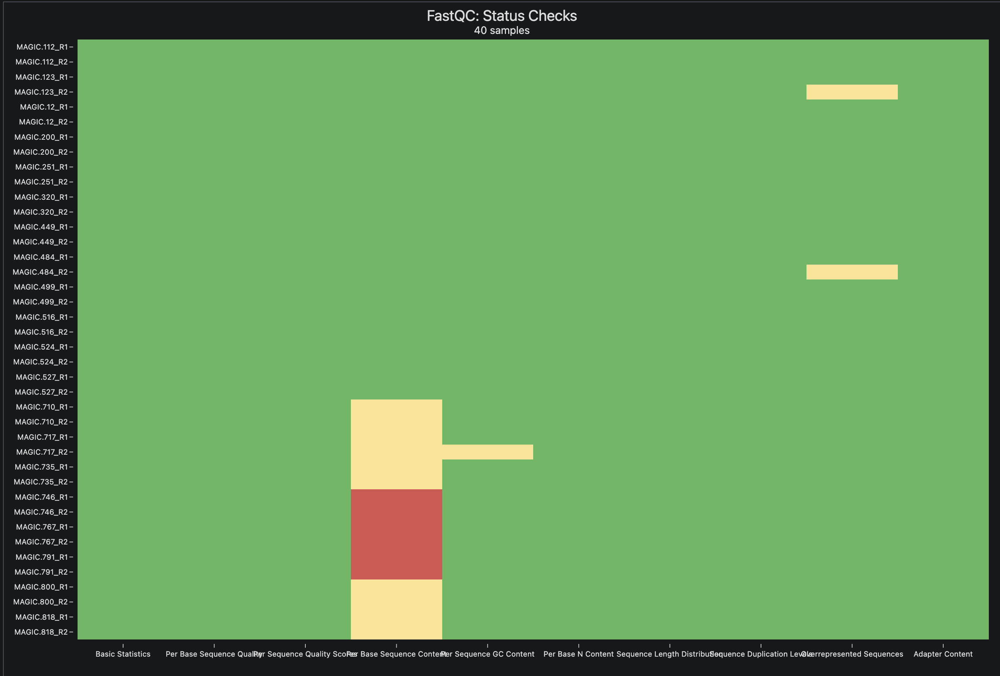

{.content-image .article-hero-image width="936"}

## Daftar isi

1.  [Pendahuluan](#pendahuluan)
2.  [Dataset dan rancangan latihan](#dataset-dan-rancangan-latihan)
3.  [Persiapan lingkungan analisis](#persiapan-lingkungan-analisis)
4.  [Metadata sampel](#metadata-sampel)
5.  [Menyiapkan genom referensi](#menyiapkan-genom-referensi)
6.  [Mengunduh dan mengubah SRA menjadi FASTQ](#mengunduh-dan-mengubah-sra-menjadi-fastq)
7.  [Kendali mutu reads](#kendali-mutu-reads)
8.  [Alignment dan read group](#alignment-dan-read-group)
9.  [Menandai duplikat dan memeriksa BAM](#menandai-duplikat-dan-memeriksa-bam)
10. [Membuat GVCF setiap individu](#membuat-gvcf-setiap-individu)
11. [Joint genotyping](#joint-genotyping)
12. [Memfilter situs dan genotipe](#memfilter-situs-dan-genotipe)
13. [Mengevaluasi VCF multisampel](#mengevaluasi-vcf-multisampel)
14. [Membuat matriks dosis alel](#membuat-matriks-dosis-alel)
15. [Keterbatasan latihan](#keterbatasan-latihan)
16. [Penutup](#penutup)

## Pendahuluan {#pendahuluan}

Pada [tutorial pertama](work-variant-calling.html), kita memanggil varian dari satu isolat bakteri. Alur tersebut cukup untuk mengenalkan hubungan antara FASTQ, alignment, BAM, dan VCF. Dalam kebanyakan kasus data sesederhana bakteri tersebut sering kali sangat jarang. Satu populasi dapat berisi puluhan sampai ribuan individu, dan setiap individu harus tetap dapat dikenali sejak data mentah dibaca sampai matriks genotipe dibuat.

Ada dua perubahan penting ketika jumlah sampel bertambah. Pertama, nama sampel tidak boleh hanya bergantung pada nama file. Identitas itu perlu ditulis di *read group* BAM dan harus konsisten dengan metadata. Kedua, varian tidak sebaiknya dipanggil secara terpisah lalu VCF-nya digabungkan. GATK menyimpan bukti genotipe setiap individu dalam GVCF, kemudian menilai semua individu bersama-sama melalui *joint genotyping*. Dengan cara ini, posisi yang sama dinilai pada seluruh kohort.

Tutorial ini memakai 20 individu diploid *Arabidopsis thaliana*. Hasil akhirnya adalah VCF multisampel dan matriks dosis alel 0, 1, dan 2. Sehingga menyerupai salah satu input utama dalam *genomic selection*.

Alur yang akan dikerjakan adalah:

``` text
metadata + SRA + genom referensi
                 |
                 v
        FASTQ dan kendali mutu
                 |
                 v
       BAM per individu + read group
                 |
                 v
            GVCF per individu
                 |
                 v
     GenomicsDBImport + GenotypeGVCFs
                 |
                 v
          VCF multisampel terfilter
                 |
                 v
          matriks dosis alel 0/1/2
```

## Dataset dan rancangan latihan {#dataset-dan-rancangan-latihan}

Data berasal dari [NCBI BioProject PRJEB19252](https://www.ncbi.nlm.nih.gov/bioproject/PRJEB19252), proyek sekuensing populasi MAGIC *A. thaliana*. MAGIC adalah populasi hasil persilangan beberapa tetua yang dilanjutkan dengan inbreeding. Kita mengambil 20 *recombinant inbred lines* dari proyek tersebut. Seluruh run memakai WGS *paired-end* Illumina.

Ukuran gabungan arsip SRA untuk 20 run ini sekitar 324 MB. FASTQ, BAM, GVCF, indeks, dan file sementara akan memakai ruang yang lebih besar. Siapkan sedikitnya 8 GB ruang kosong meskipun ukuran data unduhannya kecil.

| Sampel    | Run SRA    | BioSample      | Ukuran SRA (MB) |
|-----------|------------|----------------|----------------:|
| MAGIC.112 | ERR1869602 | SAMEA103891590 |              16 |
| MAGIC.12  | ERR1869610 | SAMEA103891598 |              15 |
| MAGIC.123 | ERR1869614 | SAMEA103891602 |              16 |
| MAGIC.200 | ERR1869678 | SAMEA103891666 |              15 |
| MAGIC.251 | ERR1869719 | SAMEA103891707 |              15 |
| MAGIC.320 | ERR1869768 | SAMEA103891756 |              15 |
| MAGIC.449 | ERR1869878 | SAMEA103891866 |              15 |
| MAGIC.484 | ERR1869908 | SAMEA103891896 |              15 |
| MAGIC.499 | ERR1869920 | SAMEA103891908 |              16 |
| MAGIC.516 | ERR1869935 | SAMEA103891923 |              16 |
| MAGIC.524 | ERR1869942 | SAMEA103891930 |              15 |
| MAGIC.527 | ERR1869944 | SAMEA103891932 |              15 |
| MAGIC.710 | ERR1869971 | SAMEA103891959 |              17 |
| MAGIC.717 | ERR1869977 | SAMEA103891965 |              18 |
| MAGIC.735 | ERR1869997 | SAMEA103891985 |              18 |
| MAGIC.746 | ERR1870008 | SAMEA103891996 |              18 |
| MAGIC.767 | ERR1870019 | SAMEA103892007 |              18 |
| MAGIC.791 | ERR1870039 | SAMEA103892027 |              17 |
| MAGIC.800 | ERR1870048 | SAMEA103892036 |              17 |
| MAGIC.818 | ERR1870062 | SAMEA103892050 |              17 |

Genom referensi yang dipakai adalah TAIR10.1 dengan accession `GCF_000001735.4`. Analisis dibatasi pada lima kromosom inti.

Data ini mempunyai cakupan rendah (*low coverage*), rata-rata sekitar 0,36× per individu. Karena itu, banyak genotipe akan hilang. Kondisi tersebut memang kurang ideal, tetapi berguna sebagai bahan pemebelajaran tentang bagaimana skema *variant calling* dilakukan.

## Persiapan lingkungan analisis {#persiapan-lingkungan-analisis}

Tutorial memakai environment Conda `gatk-snp` yang sudah dibuat pada [part 1](work-variant-calling.html) sebelumnya.

``` bash
conda activate gatk-snp
```

Pipeline utama menggunakan BWA-MEM2. Jika tool ini belum tersedia, tambahkan paketnya ke environment yang sama:

``` bash
conda install -n gatk-snp \
  -c conda-forge -c bioconda \
  bwa-mem2 \
  -y

conda activate gatk-snp
```

::: {.callout-note collapse="true"}
## Alternatif: Instal Bowtie2

``` bash
conda install -n gatk-snp \
  -c conda-forge -c bioconda \
  bowtie2 \
  -y

conda activate gatk-snp
```
:::

Pastikan program yang dibutuhkan dapat dipanggil:

``` bash
gatk --version
bwa-mem2 version
samtools --version | head -n 1
bcftools --version | head -n 1
prefetch --version
fasterq-dump --version
fastqc --version
multiqc --version
seqkit version
datasets version
```

Saya bekerja di direktori `/Users/aguswibowo/JCU/Research/Analysis/Bioinfonote/docs/data/variant-calling-part-2.` Jika Anda bekerja pada direktori lain, silahkan disesuaikan. Saat ini saya menyimpan semua data di `docs/data/variant-calling-part-2/`. Pada direktori ini, kita akan membuat beberapa sub direktori kerja, seperti `raw, sra, fastq, ref, aligned, gvcf, variants, qc, tmp`, dan `logs`

``` bash
cd /Users/aguswibowo/JCU/Research/Analysis/Bioinfonote

VC_WORK="$PWD/docs/data/variant-calling-part-2"

mkdir -p "$VC_WORK"/{raw/sra,raw/fastq,ref,aligned,gvcf,variants,qc,tmp,logs}
cd "$VC_WORK"
```

## Metadata sampel {#metadata-sampel}

Buat `samples.tsv` sebagai sumber identitas sampel. Kolom `sample` akan menjadi nama individu di BAM, GVCF, VCF multisampel, dan matriks dosis.

``` bash
awk 'BEGIN{OFS="\t"} {print $1, $2, $3, $4}' > samples.tsv <<'EOF'
sample  run biosample   sra_size_mb
MAGIC.112   ERR1869602  SAMEA103891590  16
MAGIC.12    ERR1869610  SAMEA103891598  15
MAGIC.123   ERR1869614  SAMEA103891602  16
MAGIC.200   ERR1869678  SAMEA103891666  15
MAGIC.251   ERR1869719  SAMEA103891707  15
MAGIC.320   ERR1869768  SAMEA103891756  15
MAGIC.449   ERR1869878  SAMEA103891866  15
MAGIC.484   ERR1869908  SAMEA103891896  15
MAGIC.499   ERR1869920  SAMEA103891908  16
MAGIC.516   ERR1869935  SAMEA103891923  16
MAGIC.524   ERR1869942  SAMEA103891930  15
MAGIC.527   ERR1869944  SAMEA103891932  15
MAGIC.710   ERR1869971  SAMEA103891959  17
MAGIC.717   ERR1869977  SAMEA103891965  18
MAGIC.735   ERR1869997  SAMEA103891985  18
MAGIC.746   ERR1870008  SAMEA103891996  18
MAGIC.767   ERR1870019  SAMEA103892007  18
MAGIC.791   ERR1870039  SAMEA103892027  17
MAGIC.800   ERR1870048  SAMEA103892036  17
MAGIC.818   ERR1870062  SAMEA103892050  17
EOF
```

Perintah `awk` di atas mengubah pemisah berupa spasi pada blok kode menjadi tab yang sebenarnya. Langkah ini diperlukan karena editor atau halaman web dapat mengubah karakter tab menjadi beberapa spasi.

Periksa jumlah baris dan duplikasi identifier sebelum mengunduh data:

``` bash
set -euo pipefail

test "$(awk 'END{print NR-1}' samples.tsv)" -eq 20

awk -F '\t' 'NF != 4 {
  print "Format salah pada baris", NR > "/dev/stderr"
  exit 1
}' samples.tsv

test "$(tail -n +2 samples.tsv | cut -f1 | sort -u | wc -l | tr -d ' ')" -eq 20
test "$(tail -n +2 samples.tsv | cut -f2 | sort -u | wc -l | tr -d ' ')" -eq 20
test "$(tail -n +2 samples.tsv | cut -f3 | sort -u | wc -l | tr -d ' ')" -eq 20

echo "OK: metadata berisi 20 sampel dengan empat kolom dan identifier unik."
```

Perintah `test` mengikuti kebiasaan program Unix. Ketika syarat terpenuhi, perintah selesai dengan status 0 tanpa mencetak apa pun. Jika syarat tidak terpenuhi, statusnya bukan 0. Karena blok memakai `set -e`, eksekusi langsung berhenti saat pemeriksaan gagal. Pesan `OK` hanya tercetak setelah semua pemeriksaan pada blok tersebut lolos.

Jika blok berhenti sebelum pesan `OK`, periksa `samples.tsv`. Karena nama sampel ganda akan menimbulkan masalah pada *joint genotyping*.

## Menyiapkan genom referensi {#menyiapkan-genom-referensi}

Unduh assembly TAIR10.1 dari NCBI:

``` bash
datasets download genome accession GCF_000001735.4 \
  --include genome \
  --filename ref/tair10.zip

unzip -q ref/tair10.zip -d ref/ncbi_dataset

cp ref/ncbi_dataset/ncbi_dataset/data/GCF_000001735.4/GCF_000001735.4_TAIR10.1_genomic.fna \
  ref/tair10.fa
```

Lihat ukuran dan jumlah sekuens referensi:

``` bash
seqkit stats ref/tair10.fa
```

GATK, samtools, dan BWA-MEM2 membutuhkan indeks yang berbeda. Buat ketiganya dari FASTA yang sama:

``` bash
samtools faidx ref/tair10.fa

gatk CreateSequenceDictionary \
  -R ref/tair10.fa \
  -O ref/tair10.dict

bwa-mem2 index ref/tair10.fa
```

Indeks BWA-MEM2 tidak dapat dipakai oleh aligner lain. Alignment harus memakai FASTA yang sama dengan yang digunakan pada tahap ini.

::: {.callout-note collapse="true"}
## Alternatif: Buat indeks Bowtie2

``` bash
bowtie2-build ref/tair10.fa ref/tair10
```
:::

Simpan accession lima kromosom inti dalam satu file interval:

``` bash
cat > ref/nuclear.list <<'EOF'
NC_003070.9
NC_003071.7
NC_003074.8
NC_003075.7
NC_003076.8
EOF
```

Pastikan seluruh accession ditemukan pada indeks FASTA:

``` bash
while read -r contig; do
  awk -v c="$contig" '$1==c{found=1} END{exit !found}' ref/tair10.fa.fai
done < ref/nuclear.list
```

Nama kontig harus sama pada FASTA, BAM, GVCF, dan file interval. Mengganti `NC_003070.9` menjadi `Chr1`, misalnya, akan membuat GATK menganggapnya sebagai kontig yang berbeda.

## Mengunduh dan mengubah SRA menjadi FASTQ {#mengunduh-dan-mengubah-sra-menjadi-fastq}

Unduh satu run per proses. Cara ini lebih mudah dilanjutkan jika koneksi terputus dan tidak membuat seluruh daftar gagal karena satu accession bermasalah.

``` bash
set -euo pipefail

tail -n +2 samples.tsv |
while read -r sample run biosample size_mb; do
  echo "Mengunduh $run untuk $sample"

  if [[ ! -s "raw/sra/$run/$run.sra" ]]; then
    prefetch \
      --max-size 100M \
      --output-directory raw/sra \
      "$run"
  fi

  vdb-validate "raw/sra/$run/$run.sra"
done
```

NCBI sesekali mungkin akan gagal me-resolve accession meskipun run tersedia. Jalankan kembali run yang gagal dengan perintah yang sama. `prefetch` akan mempertahankan run yang sudah selesai sehingga unduhan tidak perlu diulang dari awal.

Konversi setiap arsip menjadi FASTQ berpasangan, kompres, lalu ganti nama file dengan nama individu:

``` bash
set -euo pipefail

tail -n +2 samples.tsv |
while read -r sample run biosample size_mb; do
  echo "Mengubah $run menjadi FASTQ untuk $sample"

  if [[ ! -s "raw/fastq/${sample}_R1.fastq.gz" || \
        ! -s "raw/fastq/${sample}_R2.fastq.gz" ]]; then

    fasterq-dump "raw/sra/$run/$run.sra" \
      --split-files \
      --threads 4 \
      --temp tmp \
      --outdir raw/fastq

    pigz -p 4 \
      "raw/fastq/${run}_1.fastq" \
      "raw/fastq/${run}_2.fastq"

    mv "raw/fastq/${run}_1.fastq.gz" \
      "raw/fastq/${sample}_R1.fastq.gz"
    mv "raw/fastq/${run}_2.fastq.gz" \
      "raw/fastq/${sample}_R2.fastq.gz"
  fi
done
```

Periksa jumlah file dan kecocokan jumlah reads R1 dengan R2:

``` bash
set -euo pipefail

test "$(find raw/fastq -name '*_R1.fastq.gz' | wc -l | tr -d ' ')" -eq 20
test "$(find raw/fastq -name '*_R2.fastq.gz' | wc -l | tr -d ' ')" -eq 20

echo "OK: ditemukan 20 file R1 dan 20 file R2."

tail -n +2 samples.tsv |
while read -r sample run biosample size_mb; do
  r1=$(seqkit stats -T "raw/fastq/${sample}_R1.fastq.gz" | awk 'NR==2{print $4}')
  r2=$(seqkit stats -T "raw/fastq/${sample}_R2.fastq.gz" | awk 'NR==2{print $4}')

  printf '%s\t%s\t%s\n' "$sample" "$r1" "$r2"
  test "$r1" -eq "$r2"
done

echo "OK: jumlah reads R1 dan R2 cocok pada semua sampel."
```

## Kendali mutu reads {#kendali-mutu-reads}

FastQC memeriksa kualitas basa, kandungan GC, duplikasi, dan adapter pada setiap file. MultiQC mengumpulkan 40 laporan tersebut menjadi satu halaman.

``` bash
mkdir -p qc/fastqc qc/multiqc

fastqc \
  --threads 4 \
  --outdir qc/fastqc \
  raw/fastq/*.fastq.gz

multiqc qc \
  --outdir qc/multiqc \
  --force
```

Buka `qc/multiqc/multiqc_report.html`.

{width="90%"}

Terlihat bahwa secara umum kualitas dataset cukup baik, jadi tidak perlu melakukan trimming lagi. Namun jika pada sampel lain anda menemukan laporan yang menunjukkan adapter yang kuat, lakukan trimming dengan parameter yang sama untuk seluruh individu, kemudian jalankan FastQC kembali. Jangan memangkas hanya sampel yang hasilnya kurang rapi karena perlakuan yang tidak konsisten dapat menambah bias antarsampel.

## Alignment dan read group {#alignment-dan-read-group}

Setiap pasangan FASTQ dipetakan ke TAIR10.1 menggunakan BWA-MEM2. *Read group* menyimpan identitas run dan sampel di header BAM. Field `SM` harus sama dengan nama individu pada `samples.tsv` karena GATK akan memakainya sebagai nama sampel.

``` bash
set -euo pipefail

tail -n +2 samples.tsv |
while read -r sample run biosample size_mb; do
  echo "Alignment $sample"

  rg="@RG\\tID:${run}\\tSM:${sample}\\tPL:ILLUMINA\\tLB:MAGIC\\tPU:${run}"

  bwa-mem2 mem \
    -t 4 \
    -R "$rg" \
    ref/tair10.fa \
    "raw/fastq/${sample}_R1.fastq.gz" \
    "raw/fastq/${sample}_R2.fastq.gz" \
  | samtools sort \
      -@ 4 \
      -o "aligned/${sample}.sorted.bam"
done
```

Parameter `-t 4` meminta BWA-MEM2 memakai empat thread. Opsi `-R` menambahkan satu baris *read group* ke header SAM. Di dalam variabel `rg`, `\\t` sengaja dipertahankan sebagai teks agar BWA-MEM2 mengubahnya menjadi pemisah tab. Tanda `|` meneruskan SAM langsung ke `samtools sort`, sehingga pipeline tidak perlu menyimpan file SAM yang besar.

::: {.callout-note collapse="true"}
## Alternatif: Alignment dengan Bowtie2

Setiap pasangan FASTQ dipetakan ke TAIR10.1 menggunakan Bowtie2. *Read group* menyimpan identitas run dan sampel di header BAM.

``` bash
set -euo pipefail

tail -n +2 samples.tsv |
while read -r sample run biosample size_mb; do
  echo "Alignment $sample"

  bowtie2 \
    --very-sensitive \
    --threads 4 \
    -x ref/tair10 \
    -1 "raw/fastq/${sample}_R1.fastq.gz" \
    -2 "raw/fastq/${sample}_R2.fastq.gz" \
    --rg-id "$run" \
    --rg "SM:$sample" \
    --rg "PL:ILLUMINA" \
    --rg "LB:MAGIC" \
    --rg "PU:$run" \
  | samtools sort \
      -@ 4 \
      -o "aligned/${sample}.sorted.bam"
done
```

Arti parameter pada perintah tersebut adalah:

- `--very-sensitive` memakai preset Bowtie2 yang mencari kecocokan lebih teliti daripada mode default. Preset ini memperpanjang pencarian dan memakai seed yang lebih pendek, sehingga lebih banyak reads yang sedikit berbeda dari referensi dapat dipetakan, dengan waktu komputasi yang mungkin sedikit lebih lama.
- `--threads 4` memakai empat thread CPU saat Bowtie2 melakukan alignment. Sesuaikan angka ini dengan jumlah core yang tersedia agar beberapa sampel yang berjalan bersamaan tidak berebut sumber daya.
- `-x ref/tair10` menunjuk basename indeks Bowtie2, yaitu file indeks yang dibuat dengan `bowtie2-build ref/tair10.fa ref/tair10`; ekstensi file indeks tidak ditulis.
- `-1` dan `-2` masing-masing menunjuk FASTQ mate pertama dan kedua. Kedua opsi ini memberi tahu Bowtie2 bahwa data adalah *paired-end*, sehingga jarak dan orientasi pasangan reads ikut dipertimbangkan saat pemetaan.
- `--rg-id "$run"` menetapkan nilai `ID` pada *read group*. Di tutorial ini, accession run SRA dipakai sebagai identifier unik untuk satu proses sekuensing.
- `--rg "SM:$sample"` menambahkan field `SM` (*sample*) ke *read group*. Nilainya harus sama dengan nama individu pada `samples.tsv` karena GATK menggunakannya sebagai nama sampel pada GVCF dan VCF akhir.
- `--rg "PL:ILLUMINA"` mengisi field `PL` (*platform*) untuk mencatat teknologi sekuensing yang digunakan.
- `--rg "LB:MAGIC"` mengisi field `LB` (*library*). Semua data latihan diberi nama library `MAGIC`; pada data nyata, gunakan identifier library yang sesuai dengan preparasi pustaka.
- `--rg "PU:$run"` mengisi field `PU` (*platform unit*) dengan accession run. Field ini membantu membedakan unit sekuensing apabila satu sampel berasal dari beberapa run atau lane.

Tanda `|` (dibaca: pipe) meneruskan output SAM dari Bowtie2 ke `samtools sort` tanpa membuat file SAM sementara. Pada perintah `samtools sort`, `-@ 4` memakai empat thread tambahan untuk kompresi dan pengurutan, sedangkan `-o "aligned/${sample}.sorted.bam"` menentukan nama BAM keluaran yang sudah diurutkan berdasarkan koordinat. Dengan menggunakan Bowtie2, kita bisa mengetahui bagaimana kualitas alignment yang dilakukan. Misal pada data ini, sekitar 93 - 96% reads berhasil dilakukan alignment dengan baik.

``` {.text .terminal-output}
412428 reads; of these:
  412428 (100.00%) were paired; of these:
    34058 (8.26%) aligned concordantly 0 times
    261063 (63.30%) aligned concordantly exactly 1 time
    117307 (28.44%) aligned concordantly >1 times
    ----
    34058 pairs aligned concordantly 0 times; of these:
      2465 (7.24%) aligned discordantly 1 time
    ----
    31593 pairs aligned 0 times concordantly or discordantly; of these:
      63186 mates make up the pairs; of these:
        39384 (62.33%) aligned 0 times
        12819 (20.29%) aligned exactly 1 time
        10983 (17.38%) aligned >1 times
95.23% overall alignment rate
```
:::

Nilai setelah `SM:` harus sama dengan `MAGIC.112`. Pemeriksaan berikut memastikan aturan itu berlaku pada semua BAM:

``` bash
set -euo pipefail

tail -n +2 samples.tsv |
while read -r sample run biosample size_mb; do
  observed=$(samtools view -H "aligned/${sample}.sorted.bam" |
    awk -F '\t' '$1=="@RG" {
      for (i=2; i<=NF; i++) {
        if ($i ~ /^SM:/) {
          sub(/^SM:/, "", $i)
          print $i
        }
      }
    }' | sort -u)

  test "$observed" = "$sample"
done

echo "OK: read group semua BAM sesuai dengan samples.tsv."
```

Kesalahan nama pada tahap ini sebaiknya diperbaiki dengan mengulang alignment. Mengganti nama file BAM tidak akan mengubah `SM` di dalam header.

## Menandai duplikat dan memeriksa BAM {#menandai-duplikat-dan-memeriksa-bam}

GATK `MarkDuplicates` menandai pasangan reads yang kemungkinan berasal dari molekul DNA yang sama. Reads tetap ada di BAM, tetapi penandanya dapat dipakai oleh GATK pada tahap berikutnya.

``` bash
set -euo pipefail

tail -n +2 samples.tsv |
while read -r sample run biosample size_mb; do
  echo "Menandai duplikat $sample"

  gatk --java-options "-Xmx6g" MarkDuplicates \
    -I "aligned/${sample}.sorted.bam" \
    -O "aligned/${sample}.dedup.bam" \
    -M "qc/${sample}.duplicate_metrics.txt" \
    --CREATE_INDEX true
done
```

Buat BED untuk lima kromosom inti, lalu kumpulkan statistik alignment dan cakupan:

``` bash
awk 'BEGIN{OFS="\t"}
     NR==FNR {keep[$1]=1; next}
     keep[$1] {print $1, 0, $2}' \
  ref/nuclear.list ref/tair10.fa.fai \
  > ref/nuclear.bed

tail -n +2 samples.tsv |
while read -r sample run biosample size_mb; do
  samtools quickcheck -v "aligned/${sample}.dedup.bam"

  samtools flagstat "aligned/${sample}.dedup.bam" \
    > "qc/${sample}.flagstat.txt"

  {
    header=1
    while IFS=$'\t' read -r contig start end; do
      if [[ "$header" -eq 1 ]]; then
        samtools coverage \
          --region "${contig}:$((start + 1))-${end}" \
          "aligned/${sample}.dedup.bam"
        header=0
      else
        samtools coverage \
          --no-header \
          --region "${contig}:$((start + 1))-${end}" \
          "aligned/${sample}.dedup.bam"
      fi
    done < ref/nuclear.bed
  } > "qc/${sample}.coverage.tsv"
done

multiqc qc \
  --outdir qc/multiqc \
  --force
```

Karena data memang dirancang sebagai WGS cakupan rendah, kedalaman rata-rata yang kecil bukan kesalahan pipeline. Sampel perlu dicurigai jika jumlah reads, persentase mapping, atau cakupannya jauh lebih rendah daripada sampel lain.

Setelah BAM deduplikasi selesai dan sudah diperiksa, BAM `*.sorted.bam` dapat dihapus untuk menghemat ruang. Simpan hanya `*.dedup.bam`, indeks `.bai`, dan metriknya. Hapus file perantara hanya jika Anda yakin tahap sebelumnya berhasil.

## Membuat GVCF setiap individu {#membuat-gvcf-setiap-individu}

Pada mode GVCF, HaplotypeCaller mencatat bukti pada posisi varian dan blok posisi nonvarian. Kita memperoleh satu GVCF per individu, bukan satu VCF final per individu.

``` bash
set -euo pipefail

tail -n +2 samples.tsv |
while read -r sample run biosample size_mb; do
  echo "Membuat GVCF $sample"

  gatk --java-options "-Xmx6g" HaplotypeCaller \
    -R ref/tair10.fa \
    -I "aligned/${sample}.dedup.bam" \
    -O "gvcf/${sample}.g.vcf.gz" \
    -ERC GVCF \
    --sample-ploidy 2 \
    -L ref/nuclear.list
done
```

Periksa jumlah GVCF, indeks, dan nama sampelnya:

``` bash
set -euo pipefail

test "$(find gvcf -name '*.g.vcf.gz' | wc -l | tr -d ' ')" -eq 20

echo "OK: ditemukan 20 GVCF."

tail -n +2 samples.tsv |
while read -r sample run biosample size_mb; do
  test -s "gvcf/${sample}.g.vcf.gz"
  test -s "gvcf/${sample}.g.vcf.gz.tbi"

  observed=$(bcftools query -l "gvcf/${sample}.g.vcf.gz")
  test "$observed" = "$sample"
done

echo "OK: semua GVCF memiliki indeks dan nama sampel yang benar."
```

Memeriksa nama sampel di sini mencegah masalah yang lebih sulit dilacak setelah 20 GVCF dimasukkan ke GenomicsDB.

## Joint genotyping {#joint-genotyping}

`GenomicsDBImport` membutuhkan *sample map* dua kolom: nama sampel dan lokasi absolut GVCF. Buat file tersebut dari metadata:

``` bash
while read -r sample run biosample size_mb; do
  [[ "$sample" == "sample" ]] && continue
  printf '%s\t%s/gvcf/%s.g.vcf.gz\n' "$sample" "$PWD" "$sample"
done < samples.tsv > variants/gvcf.sample_map

column -t variants/gvcf.sample_map
```

Impor seluruh GVCF pada lima kromosom inti:

``` bash
gatk --java-options "-Xmx6g" GenomicsDBImport \
  --genomicsdb-workspace-path variants/genomicsdb \
  --sample-name-map variants/gvcf.sample_map \
  --reader-threads 4 \
  -L ref/nuclear.list
```

Lakukan *joint genotyping* untuk menghasilkan satu VCF multisampel:

``` bash
gatk --java-options "-Xmx6g" GenotypeGVCFs \
  -R ref/tair10.fa \
  -V gendb://variants/genomicsdb \
  -O variants/cohort.raw.vcf.gz
```

Periksa apakah VCF berisi tepat 20 sampel dengan nama yang sama seperti metadata:

``` bash
set -euo pipefail

test "$(bcftools query -l variants/cohort.raw.vcf.gz | wc -l | tr -d ' ')" -eq 20

diff \
  <(tail -n +2 samples.tsv | cut -f1 | sort) \
  <(bcftools query -l variants/cohort.raw.vcf.gz | sort)

echo "OK: VCF kohort berisi 20 sampel yang sama dengan samples.tsv."
```

Jika `diff` tidak menampilkan apa pun, kedua daftar sama. Inilah alasan GVCF tidak sekadar digabungkan memakai `bcftools concat`: `GenotypeGVCFs` menilai bukti semua individu pada posisi yang sama.

## Memfilter situs dan genotipe {#memfilter-situs-dan-genotipe}

Filtering dilakukan pada dua tingkat. Filter situs menilai mutu posisi varian untuk seluruh kohort. Filter genotipe menilai apakah panggilan satu individu pada posisi tersebut cukup didukung oleh reads.

### Memilih SNP bialelik

``` bash
gatk SelectVariants \
  -R ref/tair10.fa \
  -V variants/cohort.raw.vcf.gz \
  --select-type-to-include SNP \
  --restrict-alleles-to BIALLELIC \
  -O variants/cohort.raw.biallelic.snp.vcf.gz
```

SNP bialelik paling mudah diubah menjadi dosis alel 0, 1, dan 2. Indel dan situs multialelik dapat dianalisis, tetapi membutuhkan keputusan tambahan ketika matriks genotipe dibuat.

### Hard filter pada tingkat situs

Ambang berikut berasal dari rekomendasi umum GATK untuk SNP saat *Variant Quality Score Recalibration* belum dapat digunakan. Dengan kohort hanya 20 individu, anggap ambang ini sebagai titik awal latihan, bukan aturan yang berlaku untuk semua spesies atau desain sekuensing.

``` bash
gatk VariantFiltration \
  -R ref/tair10.fa \
  -V variants/cohort.raw.biallelic.snp.vcf.gz \
  -O variants/cohort.filtered.snp.vcf.gz \
  --filter-name LowQD \
  --filter-expression 'QD < 2.0' \
  --filter-name HighFS \
  --filter-expression 'FS > 60.0' \
  --filter-name HighSOR \
  --filter-expression 'SOR > 3.0' \
  --filter-name LowMQ \
  --filter-expression 'MQ < 40.0' \
  --filter-name LowMQRankSum \
  --filter-expression 'MQRankSum < -12.5' \
  --filter-name LowReadPosRankSum \
  --filter-expression 'ReadPosRankSum < -8.0'

bcftools view \
  -f PASS,. \
  -Oz \
  -o variants/cohort.pass.snp.vcf.gz \
  variants/cohort.filtered.snp.vcf.gz

bcftools index -t variants/cohort.pass.snp.vcf.gz
```

Beberapa anotasi dapat tidak tersedia pada situs dengan bukti yang sangat sedikit. Periksa log GATK dan distribusi anotasi sebelum memakai filter yang sama pada proyek produksi.

### Memfilter genotipe cakupan rendah

Data latihan mempunyai cakupan sangat rendah. Filter yang terlalu ketat dapat mengubah hampir seluruh genotipe menjadi missing. Profil berikut sengaja longgar: genotipe dengan `DP < 1` atau `GQ < 5` diubah menjadi missing.

``` bash
bcftools +setGT variants/cohort.pass.snp.vcf.gz \
  -Oz \
  -o variants/cohort.masked.snp.vcf.gz \
  -- \
  -t q \
  -n . \
  -i 'FMT/DP<1 || FMT/GQ<5'

bcftools index -t variants/cohort.masked.snp.vcf.gz
```

Untuk data dengan cakupan lebih baik, `DP < 2` dan `GQ < 10` dapat menjadi awal yang lebih masuk akal. Tetap periksa distribusinya. Menyalin ambang tanpa melihat kedalaman data sering membuat filter terlihat tegas tetapi hasilnya tidak berguna.

### Missingness dan frekuensi alel

Tambahkan `MAF` dan `F_MISSING`, lalu pertahankan situs yang teramati pada sedikitnya 20% individu dan mempunyai MAF sedikitnya 0,10:

``` bash
bcftools +fill-tags variants/cohort.masked.snp.vcf.gz \
  -Oz \
  -o variants/cohort.tagged.snp.vcf.gz \
  -- \
  -t AC,AN,AF,MAF,F_MISSING

bcftools index -t variants/cohort.tagged.snp.vcf.gz

bcftools view \
  -i 'INFO/F_MISSING<=0.80 && INFO/MAF>=0.10' \
  -Oz \
  -o variants/cohort.final.snp.vcf.gz \
  variants/cohort.tagged.snp.vcf.gz

bcftools index -t variants/cohort.final.snp.vcf.gz
```

Ambang missingness 80% terdengar sangat longgar karena memang disesuaikan untuk latihan 0,36×. VCF ini belum siap dipakai sebagai data *genomic selection* produksi. Pada data pemuliaan yang lebih dalam, batas 20% sampai 50% missing lebih umum dipertimbangkan, disertai imputasi dan validasi akurasi.

Kita juga tidak memakai filter Hardy-Weinberg equilibrium. MAGIC lines berkerabat dan sangat inbred, sedangkan uji HWE mengasumsikan populasi kawin acak. Pelanggaran HWE pada data ini dapat berasal dari rancangan populasi, bukan kesalahan genotipe.

## Mengevaluasi VCF multisampel {#mengevaluasi-vcf-multisampel}

Hitung statistik sebelum dan sesudah filtering:

``` bash
bcftools stats \
  variants/cohort.raw.vcf.gz \
  > qc/cohort.raw.stats

bcftools stats \
  -s - \
  variants/cohort.final.snp.vcf.gz \
  > qc/cohort.final.stats
```

Beberapa pemeriksaan cepat dapat dilakukan langsung dari terminal:

``` bash
printf 'Sampel pada VCF final: '
bcftools query -l variants/cohort.final.snp.vcf.gz | wc -l

printf 'SNP sebelum filtering: '
bcftools view -H variants/cohort.raw.biallelic.snp.vcf.gz | wc -l

printf 'SNP setelah filtering: '
bcftools view -H variants/cohort.final.snp.vcf.gz | wc -l
```

Pada data latihan ini, perintah tersebut menghasilkan:

``` {.text .terminal-output}
Sampel pada VCF final: 20
SNP sebelum filtering: 126701
SNP setelah filtering: 6
```

Jumlah 20 menunjukkan bahwa semua individu berhasil dipertahankan dalam VCF final. Penyusutan jumlah SNP, sebaliknya, sangat besar. Hanya 6 dari 126.701 SNP bialelik yang lolos seluruh tahap filtering, atau sekitar 0,0047%. Sebanyak 99,9953% kandidat tersaring.

Hasil ini masih masuk akal untuk data latihan dengan cakupan sekitar 0,36× per individu. Pada cakupan serendah ini, sebagian besar genotipe tidak mempunyai cukup reads untuk dipanggil dengan yakin. Setelah filter kualitas situs, masking genotipe, missingness, dan MAF diterapkan berurutan, hanya sedikit situs yang tersisa. Angka enam tidak berarti populasi MAGIC hanya mempunyai enam SNP. Angka tersebut hanya menyatakan bahwa enam SNP memenuhi seluruh kriteria pada subset data yang sangat kecil ini.

Enam SNP belum memadai untuk *genomic selection*. Jumlah tersebut terlalu kecil untuk menggambarkan variasi genom atau membangun matriks kekerabatan yang stabil. Karena tujuan bagian ini adalah mempelajari alur kerja, filter tidak dilonggarkan hanya untuk memperbanyak marker. Untuk analisis sebenarnya, pilihan yang lebih masuk akal adalah menambah kedalaman sekuensing, memperbesar jumlah individu, atau memakai metode imputasi dan pendekatan berbasis *genotype likelihood* yang memang dirancang untuk data berliput rendah.

Lihat distribusi missingness dan MAF:

``` bash
bcftools query \
  -f '%CHROM\t%POS\t%MAF\t%F_MISSING\n' \
  variants/cohort.final.snp.vcf.gz \
  > qc/site_summary.tsv

head qc/site_summary.tsv
```

Isi `qc/site_summary.tsv` pada latihan ini adalah:

``` {.text .terminal-output}
NC_003070.9 19313435    0.5 0.8
NC_003071.7 9944    0.1 0
NC_003074.8 1948872 0.25    0.8
NC_003074.8 16515305    0.25    0.8
NC_003075.7 8850832 0.25    0.8
NC_003076.8 8442176 0.3 0.5
```

Empat dari enam SNP mempunyai `F_MISSING=0.8`. Dengan 20 individu, nilai tersebut berarti hanya empat individu yang mempunyai genotipe dan 16 lainnya missing. Nilai ini tetap lolos karena ekspresi filter memakai `F_MISSING<=0.80`, sehingga batas 0,80 ikut diterima. SNP pada `NC_003076.8:8442176` dipanggil pada 10 individu, sedangkan `NC_003071.7:9944` dipanggil pada semua individu.

Nilai MAF dihitung dari alel yang berhasil dipanggil, bukan dari seluruh 20 individu. Karena itu, MAF 0,25 atau 0,50 pada situs dengan 80% genotipe missing hanya berasal dari empat individu. Nilai tersebut memenuhi filter secara teknis, tetapi belum dapat dianggap sebagai estimasi frekuensi alel populasi yang stabil.

Ringkasan per sampel tersimpan pada baris `PSC` dari [`bcftools stats`](https://samtools.github.io/bcftools/bcftools.html#stats):

``` bash
grep '^PSC' qc/cohort.final.stats \
  > qc/per_sample_counts.tsv

head qc/per_sample_counts.tsv
```

Sepuluh baris pertama pada data latihan adalah:

``` {.text .terminal-output}
PSC 0   MAGIC.112   1   1   0   1   0   0   22.0    0   0   0   4
PSC 0   MAGIC.12    2   1   0   1   0   0   18.3    0   0   0   3
PSC 0   MAGIC.123   2   0   0   0   0   0   18.5    0   0   0   4
PSC 0   MAGIC.200   2   0   0   0   0   0   25.0    0   0   0   4
PSC 0   MAGIC.251   1   0   0   0   0   0   41.0    0   0   0   5
PSC 0   MAGIC.320   1   0   2   2   0   0   32.0    0   0   0   3
PSC 0   MAGIC.449   3   0   2   2   0   0   17.4    0   0   0   1
PSC 0   MAGIC.484   1   0   2   2   0   0   5.3 0   0   0   3
PSC 0   MAGIC.499   1   1   1   2   0   0   2.7 0   0   0   3
PSC 0   MAGIC.516   2   1   0   1   0   0   23.7    0   0   0   3
```

Baris `PSC` tidak mempunyai header saat dipisahkan dengan `grep`. Setelah tiga kolom pertama (`PSC`, nomor set, dan nama sampel), kolom yang paling berguna untuk pemeriksaan ini adalah jumlah homozigot referensi, homozigot nonreferensi, heterozigot, rata-rata depth, dan genotipe missing. Kolom lainnya mencatat transisi, transversi, indel, singleton, serta panggilan haploid referensi dan alternatif.

Jumlah kategori genotipe pada setiap baris sama dengan enam situs final. Sebagai contoh, `MAGIC.112` mempunyai satu homozigot referensi, satu homozigot alternatif, tidak ada heterozigot, dan empat genotipe missing: $1+1+0+4=6$. Pada `MAGIC.251`, hanya satu dari enam situs yang mempunyai panggilan genotipe. Pemeriksaan sederhana ini menunjukkan bahwa statistik per sampel konsisten dengan jumlah SNP final.

Rata-rata depth pada kolom `PSC` merangkum situs yang ada di VCF final, bukan kedalaman rata-rata seluruh genom. Nilai seperti 22 atau 41 karena itu tidak bertentangan dengan cakupan awal sekitar 0,36×. Proses filtering cenderung menyisakan situs yang kebetulan mempunyai dukungan reads lebih baik. Jika data ini akan dianalisis lebih lanjut, situs dengan depth yang jauh lebih tinggi juga perlu diperiksa terhadap pemetaan ambigu atau daerah berulang.

Pada inbred lines, heterozigositas biasanya rendah. Beberapa sampel di atas mempunyai dua panggilan heterozigot, tetapi penyebutnya hanya enam SNP dan banyak genotipe masih missing. Proporsi tersebut terlalu tidak stabil untuk menyimpulkan kontaminasi, campuran sampel, atau masalah identitas. Kesimpulan biologis memerlukan lebih banyak marker dan pemeriksaan distribusi kualitas pada VCF sebelum filtering.

## Membuat matriks dosis alel {#membuat-matriks-dosis-alel}

Untuk SNP bialelik diploid, genotipe dapat ditulis sebagai dosis alel alternatif:

- `0/0` menjadi 0;
- `0/1` atau `1/0` menjadi 1;
- `1/1` menjadi 2; dan
- genotipe missing menjadi `NA`.

Kode berikut menulis marker pada baris dan individu pada kolom:

``` bash
{
  printf 'marker'
  bcftools query -l variants/cohort.final.snp.vcf.gz |
  while read -r sample; do
    printf '\t%s' "$sample"
  done
  printf '\n'

  bcftools query \
    -f '%CHROM:%POS:%REF:%ALT[\t%GT]\n' \
    variants/cohort.final.snp.vcf.gz |
  awk 'BEGIN{OFS="\t"}
  {
    for (i=2; i<=NF; i++) {
      gsub(/\|/, "/", $i)

      if ($i == "0/0") {
        $i = 0
      } else if ($i == "0/1" || $i == "1/0") {
        $i = 1
      } else if ($i == "1/1") {
        $i = 2
      } else {
        $i = "NA"
      }
    }
    print
  }'
} > variants/genotype_dosage.tsv
```

Periksa dimensi dan nilai yang dihasilkan:

``` bash
set -euo pipefail

variant_count=$(bcftools view -H variants/cohort.final.snp.vcf.gz | wc -l | tr -d ' ')

test "$(awk -F '\t' 'NR==1{print NF}' variants/genotype_dosage.tsv)" -eq 21
test "$(awk 'END{print NR-1}' variants/genotype_dosage.tsv)" -eq "$variant_count"

bad=$(awk -F '\t' '
  NR > 1 {
    for (i=2; i<=NF; i++) {
      if ($i != "0" && $i != "1" && $i != "2" && $i != "NA") {
        bad++
      }
    }
  }
  END {print bad+0}
' variants/genotype_dosage.tsv)

test "$bad" -eq 0

echo "OK: matriks memiliki 20 sampel, $variant_count marker, dan hanya memuat 0, 1, 2, atau NA."
```

Matriks dapat dibaca di R tanpa paket tambahan:

``` r
geno <- read.delim(
  "docs/data/variant-calling-part-2/variants/genotype_dosage.tsv",
  check.names = FALSE
)

marker <- geno$marker
M <- as.matrix(geno[, -1])
storage.mode(M) <- "numeric"
rownames(M) <- marker

dim(M)
sort(colMeans(is.na(M)), decreasing = TRUE)
```

Sebagian program *genomic selection* mengharapkan individu pada baris dan marker pada kolom. Gunakan transpose jika format tersebut dibutuhkan:

``` r
M_individu <- t(M)
dim(M_individu)
```

Jangan langsung mengganti semua `NA` dengan nilai rata-rata tanpa memeriksa pola missingness. Untuk analisis sebenarnya, pilih metode imputasi yang sesuai dengan spesies, kepadatan marker, struktur populasi, dan desain data. Akurasi imputasi sebaiknya diuji dengan menyembunyikan sebagian genotipe yang sudah diketahui.

## Keterbatasan latihan {#keterbatasan-latihan}

Tutorial ini mengajarkan bentuk pipeline, bukan menghasilkan panel marker siap produksi. Ada beberapa batas yang perlu dibawa ketika hasilnya ditafsirkan.

Data hanya mencakup 20 MAGIC lines dengan cakupan sekitar 0,36×. Banyak genotipe akan missing dan panggilan heterozigot sulit dipercaya. Filter dibuat cukup longgar agar alur dapat dipelajari; filter tersebut tidak boleh dipindahkan mentah-mentah ke proyek lain.

Populasi MAGIC mempunyai hubungan kekerabatan dan sejarah persilangan tertentu. HWE tidak cocok sebagai filter otomatis. Untuk studi lebih besar, pemeriksaan struktur populasi, kekerabatan, duplikasi sampel, kontaminasi, kedalaman, keseimbangan alel, dan batch sekuensing perlu dilakukan sebelum matriks dipakai dalam model.

Base Quality Score Recalibration tidak digunakan karena tutorial tidak menyiapkan set varian terpercaya untuk TAIR10.1. Variant Quality Score Recalibration juga tidak dipakai karena jumlah varian dan sampel terlalu kecil untuk melatih model recalibration yang stabil.

Terakhir, variant calling hanya menghasilkan genotipe. *Genomic selection* masih membutuhkan data fenotipe, pembagian data latih dan uji, kontrol struktur populasi, model prediksi, serta evaluasi yang mencegah kebocoran informasi antarkerabat.

## Penutup {#penutup}

Perbedaan utama antara variant calling satu sampel dan banyak individu ada pada pengelolaan identitas serta cara genotipe dipanggil bersama. Setiap BAM harus membawa nama sampel yang benar. HaplotypeCaller kemudian menghasilkan GVCF per individu, dan GATK menilai seluruh GVCF melalui GenomicsDBImport serta GenotypeGVCFs.

VCF multisampel yang dihasilkan belum otomatis menjadi data pemuliaan yang baik. Mutu matriks tetap bergantung pada cakupan, filter, missingness, frekuensi alel, dan strategi imputasi. Namun, setelah menyelesaikan alur ini, hubungan antara reads mentah, genotipe populasi, dan matriks dosis untuk analisis genomik sudah terlihat dengan jelas.

## Referensi

- [NCBI BioProject PRJEB19252](https://www.ncbi.nlm.nih.gov/bioproject/PRJEB19252)
- [NCBI Datasets: Arabidopsis thaliana TAIR10.1](https://www.ncbi.nlm.nih.gov/datasets/genome/GCF_000001735.4/)
- [BWA-MEM2](https://github.com/bwa-mem2/bwa-mem2) <!-- - [Bowtie2 manual](https://bowtie-bio.sourceforge.net/bowtie2/manual.shtml) -->
- [GATK HaplotypeCaller](https://gatk.broadinstitute.org/hc/en-us/articles/360037225632-HaplotypeCaller)
- [GATK GenomicsDBImport](https://gatk.broadinstitute.org/hc/en-us/articles/360036889212-GenomicsDBImport)
- [GATK GenotypeGVCFs](https://gatk.broadinstitute.org/hc/en-us/articles/360036820431-GenotypeGVCFs)
- [GATK hard filtering germline short variants](https://gatk.broadinstitute.org/hc/en-us/articles/360035890471-Hard-filtering-germline-short-variants)
- [bcftools manual](https://samtools.github.io/bcftools/bcftools.html)
- [bcftools `+fill-tags`](https://samtools.github.io/bcftools/howtos/plugin.fill-tags.html)